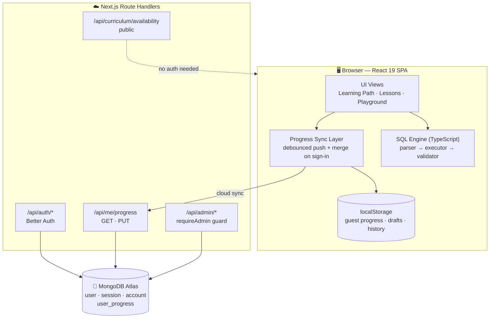
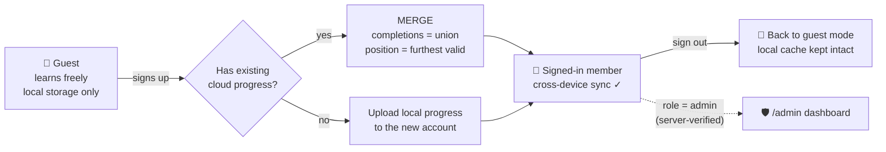
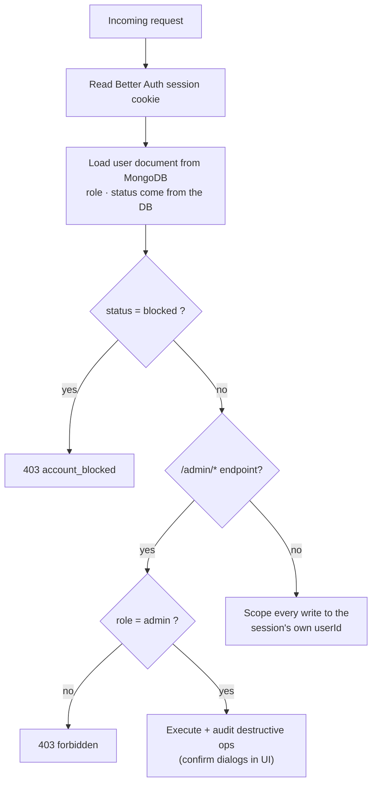

<div align="center">

# 🎓 SQLens

### Master SQL — 25 Days, One Browser Tab

**An interactive, self-contained SQL learning platform with a custom-built in-browser SQL engine.**
Write real queries. Get real results. No database server required.

[](https://nextjs.org)
[](https://react.dev)
[](https://www.typescriptlang.org)
[](https://tailwindcss.com)
[](https://www.better-auth.com)
[](https://www.mongodb.com)
[](https://vercel.com)

</div>

---

## 📖 Table of Contents

- [What is SQLens?](#-what-is-sqlens)
- [Feature Highlights](#-feature-highlights)
- [Architecture Overview](#️-architecture-overview)
- [The SQL Engine](#-the-sql-engine)
- [User Modes — Guest, Member, Admin](#-user-modes--guest-member-admin)
- [Progress Synchronization](#-progress-synchronization)
- [Module Unlock System](#-module-unlock-system)
- [SQL Playground](#%EF%B8%8F-sql-playground)
- [Admin Dashboard](#%EF%B8%8F-admin-dashboard)
- [Getting Started](#-getting-started)
- [Environment Variables](#-environment-variables)
- [Project Structure](#-project-structure)
- [Available Scripts](#-available-scripts)
- [API Reference](#-api-reference)
- [Database Schema](#-database-schema)
- [Security Model](#%EF%B8%8F-security-model)
- [Deployment](#-deployment)
- [Quality & Testing](#-quality--testing)

---

## 🔍 What is SQLens?

SQLens is a **complete 25-day SQL curriculum** wrapped around a custom SQL engine
that runs entirely in your browser — parser, executor, and validator are all written
from scratch in TypeScript, with zero external query libraries.

```
 ┌─────────────────────────────────────────────────────────────────┐
 │                            SQLens                               │
 │                                                                 │
 │   🗺️ Learning Path ─── 📘 Lesson ─── ✍️ Practice ─── 🏆 Challenge │
 │        ▲                  │                                     │
 │        │                  ▼                                     │
 │   Progress saved       In-browser SQL engine                    │
 │   (local + cloud)      parse → execute → validate               │
 └─────────────────────────────────────────────────────────────────┘
```

Every day of the course follows the same loop:

1. **📖 Concept Lesson** — read short, focused theory cards.
2. **✍️ Guided Practice** — solve tasks against a seeded sample database with instant validation.
3. **🏆 Independent Challenge** — apply the day's concepts to new problems, no hand-holding.
4. **🎉 Module Completion** — celebrate, then wait for the next module to unlock.

### Why you'll like it

| | |
|---|---|
| ⚡ **Instant feedback** | Queries execute locally in milliseconds — no round-trips, works offline |
| 🧠 **Real understanding** | Practice tasks are *thinkable*, not fill-in-the-blank answer copying |
| 💾 **Cross-device progress** | Sign in on your laptop, continue exactly where you left off on your phone |
| 👀 **Guest-friendly** | Learn everything without ever creating an account |

## ✨ Feature Highlights

<details open>
<summary><b>🎓 Curriculum & Learning</b></summary>

- **25 structured days** — from basic `SELECT` through joins, aggregation, subqueries, CTEs, window functions, and DDL
- Guided practice with step-by-step hints, attempt tracking, and optional solutions
- Independent challenge sets per module
- **Real App Router routes** — every lesson is a URL (`/learn/day-07/theory/aggregates`, `/learn/day-07/practice/aggregates?task=1`, `/learn/day-07/challenge`) with its own metadata, canonical URL and prefetch; module overviews are statically prerendered; browser Back/Forward and shared links land exactly on the lesson step
- Legacy deep links (`?day=7&stage=practice&concept=2`) are **server-redirected** to the new URLs automatically
- Reset-progress safety net per learner

</details>

<details>
<summary><b>⚙️ Custom SQL Engine (no dependencies)</b></summary>

- Full `SELECT` pipeline: projections, aliases, WHERE logic, ORDER BY, LIMIT/OFFSET
- Joins: **INNER · LEFT · LEFT OUTER · RIGHT · FULL · CROSS**
- Aggregates (`COUNT/SUM/AVG/MIN/MAX`) with GROUP BY / HAVING
- Correlated & scalar **subqueries**, IN / BETWEEN / LIKE / IS NULL / INTERVAL
- **CTEs** (`WITH name AS (...)`), set operations (**UNION / UNION ALL / INTERSECT / EXCEPT**)
- **CASE WHEN** expressions in SELECT / WHERE / ORDER BY
- DML: INSERT / UPDATE / DELETE (+ foreign-key awareness)
- DDL: CREATE TABLE / ALTER TABLE ADD COLUMN / DROP TABLE IF EXISTS, plus UNIQUE·CHECK·DEFAULT·NOT NULL basics
- EXPLAIN output rendered as a plan table

</details>

<details>
<summary><b>🎮 SQL Playground</b></summary>

- Dedicated full-page playground (terminal icon in the header)
- **Multi-statement scripts** — paste a whole `CREATE … ; INSERT … ; SELECT …;` script, get numbered result sets
- **Query history** (last 15, persisted) with one-click reload
- Draft auto-persistence — refresh-proof editor content
- **Copy / download any result as CSV**
- **Share button** — copies a URL that re-opens the exact query (`#q=<encoded>`)
- **Ctrl+Space autocomplete** — keywords, tables, columns; typo-forgiving "did you mean?" hints on errors
- **Dataset switcher** — practice on the lesson dataset or start from an empty scratch space
- Human-readable error messages with statement numbers

</details>

<details>
<summary><b>🔐 Accounts, Roles & Admin</b></summary>

- Email/password authentication via **Better Auth** + official MongoDB driver adapter
- Server-enforced roles (`user` / `admin`) and account status (`active` / `blocked`)
- Admin dashboard as real routes: `/admin` (overview + stats), `/admin/users` (searchable list with block/unblock/delete + confirmations), `/admin/modules` (curriculum availability & scheduling) — each with its own URL, all behind the same server gate
- Blocked accounts are rejected at sign-in *and* locked out of existing sessions/APIs — with a friendly "Account suspended" screen that still allows guest browsing
- All privileged actions verified server-side on every request; frontend checks are cosmetic only

</details>

## 🏗️ Architecture Overview



**Design principles**

| Principle | How it shows up |
|---|---|
| Additive, never disruptive | Guest/localStorage behavior is untouched by accounts; auth layers sit *on top* |
| Server is the source of truth | Roles, blocking, and admin actions are validated in route handlers — never trusted from the client |
| Local-first resilience | Every save hits localStorage instantly; cloud sync is debounced and flushed on tab close |
| Thin routes, fat services | Logic lives in `src/lib/*`; API handlers stay small and uniform |

---

## 🔩 The SQL Engine

All queries run client-side through three cooperating stages:

```
   SQL string
       │
       ▼
┌────────────┐   normalized SQL + parsed structure
│  Parser    │   clause splitting · JOIN / set-op / CASE detection
└─────┬──────┘
      ▼
┌────────────┐   executes against an in-memory DatabaseState
│ Executor   │   { tables: Record<string, Row[]>, schemas }
└─────┬──────┘
      ▼
┌────────────┐   compares results vs expected rows / rules
│ Validator  │   per-task validation & hint generation
└────────────┘
```

Coverage highlights (all covered by tests):

| Category | Supported |
|---|---|
| Retrieval | SELECT, DISTINCT, aliases, expressions, LIMIT, OFFSET |
| Filtering | `=`, `!=`, `<>`, `<`, `<=`, `>`, `>=`, AND/OR/NOT, IN, BETWEEN, LIKE/ILIKE, IS NULL |
| Joins | INNER, LEFT [OUTER], RIGHT, FULL, CROSS |
| Grouping | GROUP BY, HAVING, COUNT/SUM/AVG/MIN/MAX |
| Advanced | Subqueries, WITH (CTE), UNION / UNION ALL / INTERSECT / EXCEPT, CASE WHEN |
| Mutation | INSERT, UPDATE, DELETE (FK-aware) |
| Definition | CREATE TABLE, ALTER TABLE ADD COLUMN, DROP TABLE IF EXISTS |
| Introspection | EXPLAIN (mock plan output) |

## 👤 User Modes — Guest, Member, Admin

| Capability | 👻 Guest | 👤 User | 🛡️ Admin |
|---|:---:|:---:|:---:|
| Browse all lessons & curriculum | ✅ | ✅ | ✅ |
| Run queries / playground | ✅ | ✅ | ✅ |
| Progress saved across refreshes | ✅ local | ✅ local | ✅ local |
| Progress synced across devices | ❌ | ✅ | ✅ |
| Unlock modules by schedule | ✅ | ✅ | ✅ |
| Manage users / roles | ❌ | ❌ | ✅ |
| Access `/admin` dashboard | ❌ redirect | ❌ redirect | ✅ |



**Merge rules (deterministic):** completion is OR-ed across sources ("done anywhere = done"),
current position resolves to the furthest valid point, and unlock state is always recomputed —
never copied from either side.

---

## 🔄 Progress Synchronization

```
Complete a task
      │
      ├─► setUserState (React) ──► UI re-render (instant)
      │
      ├─► saveUserState ──► localStorage     ← immediate, offline-safe
      │
      └─► signed in? ── debounced 1.5s ──► PUT /api/me/progress
                                           userId comes from the session cookie,
                                           never from the request body

Tab closes while dirty?
      └─► visibilitychange / pagehide flush ──► final PUT

Sign-in detected?
      └─► GET cloud progress ──► MERGE with local ──► hydrate UI ──► upload merged state
```

Failures degrade gracefully: the local copy is already saved, so nothing is lost;
the next successful sync heals the divergence automatically.

---

## 🕕 Module Unlock System

Modules gate on **completion + time**, so learners build durable habits instead of binging:

1. Day 1 is always open.
2. Each later module needs the previous one fully complete (all concepts + its challenge).
3. The standard gate opens at the next **18:00 (6 PM)** boundary after prior-day completion.
4. Server-provided availability overrides apply on top (`automatic / manual / scheduled / locked`),
   fetched once per load from the public `/api/curriculum/availability` endpoint.

> 🔧 Legacy developer bypass toggles were retired in favor of this server-controlled model.

## 🎛️ SQL Playground

Open it from the **⌨ terminal icon** in the header — it takes over the page like a
focused workspace and remembers your draft + history between visits.

```
┌─────────────────────────────────────────────────────────────────┐
│ SQLens / PLAYGROUND   [Lesson data ▾] [History] [Reset] [Share]  │
├───────────────┬─────────────────────────────────────────────────┤
│ SCHEMA (7)    │ query.sql                                       │
│ customers     │ ┌─────────────────────────────────────────────┐ │
│  id INT       │ │ CREATE TABLE demo (id INT);                 │ │
│  name STRING  │ │ INSERT INTO demo VALUES (1),(2);            │ │
│ orders        │ │ SELECT COUNT(*) AS total FROM demo;         │ │
│  …            │ └─────────────────────────────────────────────┘ │
│               │ [Ctrl+Enter run] [Ctrl+Space suggest]    Run ▶  │
│               ├─────────────────────────────────────────────────┤
│               │ #1 ✔ executed ······ 0 rows affected            │
│               │ #2 ✔ executed ······ 2 rows affected            │
│               │ #3 ✔ 1 row · 0ms          [Copy] [CSV]          │
│               │      total                                      │
│               │      -----                                      │
│               │      2                                          │
└───────────────┴─────────────────────────────────────────────────┘
```

---

## 🛡️ Admin Dashboard

Reachable only by verified admins (role lives server-side, re-checked on every request).
Admins get a shield icon in the header linking to `/admin`.

| Route | What you get |
|---|---|
| **`/admin`** | Overview: total users, blocked count, admin count, new users (7 days), latest signups |
| **`/admin/users`** | Searchable list · role/status badges · join dates · block (reversible) · delete (destructive) |
| **`/admin/modules`** | Curriculum availability & scheduling (automatic / scheduled / manual / locked) |

| Guardrail | How |
|---|---|
| **Server gate** | `(admin)/layout.tsx` re-checks DB role + status on every request → non-admins redirect `/` |
| **API re-verification** | `requireAdmin` runs before each endpoint |
| **Destructive actions** | Confirmation dialogs; admin pages carry `robots: noindex` |

Blocked users see a calm "Account suspended" screen, may continue learning as guests, and their
data stays in MongoDB so they can be restored anytime.

## 🚀 Getting Started

**Prerequisites:** Node.js ≥ 20, npm, and a reachable MongoDB instance (Atlas free tier works great).

```bash
# 1 — install
npm install

# 2 — configure environment (see next section)
cp .env.example .env

# 3 — develop (app + auth API served together on one port)
npm run dev

# 4 — explore
open http://localhost:3000
```

**First-time admin setup** — create your own account in the app, then promote yourself
inside MongoDB Atlas (or via `mongosh`):

```js
db.user.updateOne(
  { email: "you@example.com" },
  { $set: { role: "admin" } }
)
```

Refresh the site — a shield icon appears in the header linking to `/admin`.

---

## 🔑 Environment Variables

Create a `.env` file (never commit it) based on `.env.example`:

| Variable | Required | Purpose |
|---|:---:|---|
| `BETTER_AUTH_SECRET` | ✅ | Session/token signing secret — generate with `openssl rand -base64 32` |
| `BETTER_AUTH_URL` | ✅ | Public base URL; must match your deployment (cookies + redirects depend on it) |
| `MONGODB_URI` | ✅ | Official-driver connection string — Atlas: `mongodb+srv://…`, local: `mongodb://localhost:27017/sqlens` |
| `MONGODB_DB_NAME` | ➖ | Optional db-name override (defaults to the URI's last path segment) |

Without valid MongoDB settings the app still renders and guests still work — only auth/sync
endpoints fail fast.

---

## 📂 Project Structure

```
sql_learning/
├── src/
│   ├── app/                        # Next.js App Router (route groups)
│   │   ├── layout.tsx              # HTML shell · fonts · global metadata · SEO
│   │   ├── loading.tsx             # branded route-loading skeleton
│   │   ├── error.tsx               # friendly crash boundary
│   │   ├── not-found.tsx           # custom 404
│   │   ├── (app)/                  # learning shell (Header + providers)
│   │   │   ├── layout.tsx          # AppProviders + UiChrome + AppChrome
│   │   │   ├── page.tsx            # `/` roadmap + legacy redirects
│   │   │   ├── template.tsx        # route-transition animation
│   │   │   └── learn/              # /learn + /learn/[dayId]/* lesson tree
│   │   ├── (auth)/                 # /signin, /signup (signed-in → redirect)
│   │   ├── (admin)/admin/          # /admin, /admin/users, /admin/modules
│   │   ├── robots.ts · sitemap.ts  # SEO plumbing
│   │   ├── icon.svg                # favicon (database glyph)
│   │   ├── admin/page.tsx          # server-guarded admin entry
│   │   └── api/
│   │       ├── auth/[...next]/     # Better Auth catch-all handler
│   │       ├── me/progress/        # GET · PUT cloud progress
│   │       ├── curriculum/availability/
│   │       └── admin/              # users/, users/[id]/, modules/…
│   ├── components/
│   │   ├── app/AppShell.tsx        # root state machine (views, stages, history)
│   │   ├── layout/Header.tsx       # nav · streak pill · avatar · icon buttons
│   │   ├── roadmap/                # learning path · modals
│   │   ├── learning/               # lessons · practice · challenges · playground
│   │   ├── auth/                   # AuthView · BlockedView
│   │   ├── admin/                  # dashboard, panels, dialogs
│   │   └── ui/Icon.tsx             # lucide-based icon registry
│   ├── lib/
│   │   ├── sql-engine/             # parser.ts · executor.ts · validator…
│   │   ├── progress/               # storage · unlock calculator · merge rules
│   │   ├── admin/                  # server-side user management helpers
│   │   ├── auth.ts                 # Better Auth + MongoDB adapter config
│   │   └── auth-client.ts          # browser auth client
│   ├── content/
│   │   ├── curriculum-index.ts     # module ordering & lookups
│   │   ├── modules/                # day-by-day curriculum data
│   │   └── database/               # sample schema + seed rows
│   ├── types/                      # shared TypeScript contracts
│   └── config/                     # learning + schedule constants
└── scripts/
    ├── verify-curriculum.ts        # audits every task's solution via the engine
    └── engine-tests.ts             # regression suite for the SQL engine
```

## 🧰 Available Scripts

| Command | What it does |
|---|---|
| `npm run dev` | Start Next.js dev server (app + API together) |
| `npm run build` | Production build |
| `npm start` | Serve the production build |
| `npm run lint` | TypeScript strict pass (`tsc --noEmit`) |
| `npm run test:engine` | 21-case regression suite covering the SQL engine |
| `npm run verify:curriculum` | Audits all 25 days — every task's solution is executed through the engine |
| `npm run clean` | Remove build artifacts |

---

## 🔌 API Reference

| Method & Path | Auth | Purpose |
|---|---|---|
| `POST /api/auth/sign-up/email` | public | Create account |
| `POST /api/auth/sign-in/email` | public | Sign in (blocked accounts rejected here) |
| `POST /api/auth/sign-out` | user | Destroy session |
| `GET /api/auth/session` | public | Current session probe |
| `GET /api/me/progress` | user | Fetch synced progress |
| `PUT /api/me/progress` | user | Upsert progress (userId taken from session) |
| `GET /api/curriculum/availability` | public | Global module availability map |
| `GET /api/admin/users` | **admin** | Paginated user directory |
| `PATCH /api/admin/users/:id` | **admin** | `{ action: 'block' \| 'unblock' }` |
| `DELETE /api/admin/users/:id` | **admin** | Remove user + sessions + credentials |
| `GET /api/admin/modules` | **admin** | Availability configuration |
| `PUT /api/admin/modules/:dayId` | **admin** | Override unlock mode/date for a module |

Guards: `401` unauthenticated · `403 account_blocked` · `403 forbidden` (non-admin).

---

## 🍃 Database Schema

MongoDB collections:

| Collection | Key fields | Notes |
|---|---|---|
| `user` | `_id, name, email, role: 'user'\|'admin', status: 'active'\|'blocked', createdAt` | Extended Better Auth document |
| `account` | credentials / provider linkage | Managed by Better Auth |
| `session` | user reference, expiry | Managed by Better Auth |
| `user_progress` | `userId` (unique index), `progress`, `updatedAt` | One document per member |
| `module_availability` | `dayId` (unique), `unlockMode`, `unlockAt`, flags | Server-authoritative unlocking |

Transactions are intentionally disabled in the Mongo adapter (known upstream
abort-after-commit issue); all writes are single-document by design, which sidesteps
multi-document transactions entirely.

## 🛡️ Security Model



Highlights:

- Role/status are declared `input: false` in Better Auth — clients can never escalate themselves.
- Every admin API call re-verifies against the database; hidden buttons are not access control.
- Password hashing, CSRF protection, and session lifecycle are delegated to Better Auth.
- Deletion cascades across `user`, `session`, and `account`; blocking preserves data for restore.

---

## 📦 Deployment

The repo ships with `vercel.json` pinning the Next.js framework preset:

```bash
git push        # deploy from main — Vercel builds automatically
```

Set these in **Vercel → Project → Settings → Environment Variables** (mirroring `.env`):

- `BETTER_AUTH_SECRET`
- `BETTER_AUTH_URL=https://your-app.vercel.app`
- `MONGODB_URI`
- `MONGODB_DB_NAME` *(optional)*

Adding a custom domain? Point `BETTER_AUTH_URL` (plus canonical/sitemap defaults) at it.

---

## ✅ Quality & Testing

```text
$ npm run test:engine
  ✔ 21 passed, 0 failed

$ npm run verify:curriculum
  Day 01 ✔ … Day 25 ✔
  ========================================================
  ALL DAYS VERIFIED — solutions execute cleanly end-to-end
```

Recommended release checklist:

- [ ] `tsc --noEmit` clean
- [ ] `test:engine` green
- [ ] `verify:curriculum` green
- [ ] Manual smoke test: guest learns → signs up → merges → continues cross-device
- [ ] Admin smoke test: block/unblock + lock one module before granting admin roles

---

<div align="center">

**Built with** Next.js 16 · React 19 · Tailwind v4 · Better Auth · MongoDB · lucide-icons · motion

*Learn SQL the way you'll actually use it — by writing it.*

</div>
