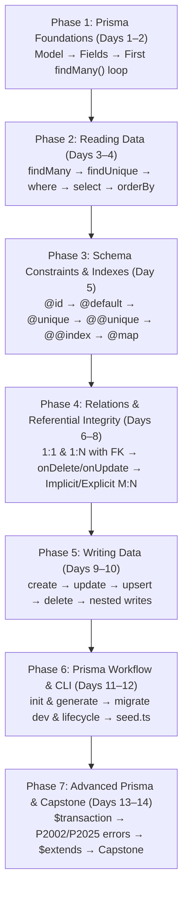

# PrismaLens Curriculum & Workspace Redesign — Implementation Plan & Tracker

> Comprehensive architecture and implementation blueprint for decoupling workspace interaction modes (`workspaceMode`) from evaluation pipelines (`gradingType`), removing cognitive noise from the learning workspace, and restructuring the 14-day Prisma curriculum into a progressive 7-phase learning journey.

---

## 1. Architectural & Pedagogical Principles

### A. Independent Workspace Modes & Grading Channels
`workspaceMode` dictates what the learner interacts with. `gradingType` dictates how the attempt is graded. They are strictly decoupled:

```typescript
// src/types/prisma-curriculum.ts
export type PrismaWorkspaceMode = 'schema' | 'query' | 'cli';

export type PrismaGradingType = 
  | 'schema-validation' 
  | 'query-result' 
  | 'output-match' 
  | 'behavioral';
```

| Mode | Editor | Primary Surface | Secondary Tabs | Hidden Distractions |
| :--- | :--- | :--- | :--- | :--- |
| **Schema Mode** | `schema.prisma` | Interactive ERD / Model Visualizer | AST Validation Checklist (`✓ Model exists`, `✗ @unique required`) | Type Inspector, SQLite query rows, SQL Lens, `MODEL: users` badge |
| **Query Mode** | `query.ts` | Clean Data Results Grid / JSON | `[ 🔍 SQL Lens ]` and `[ 🏷️ Type Inspector ]` | Raw SQL chips, schema editing controls |
| **CLI Mode** | Terminal input | Simulated Shell Console | Command flags & lifecycle explanation | Data grid, Type Inspector, schema visualizer |

---

### B. The 7-Phase Pedagogical Progression



---

### C. Core Pedagogical Rules
1. **The Day 1 Instant Loop:**  
   Write model $\rightarrow$ Run/compile $\rightarrow$ Prisma Client understands model $\rightarrow$ `prisma.user.findMany()` $\rightarrow$ See records!  
   *The learner feels the magic of the ORM before being taught the CLI and generation machinery behind the curtain.*
2. **Reading Before Relations:**  
   Learners understand relations once they've experienced `findMany()` and `findUnique()`. Asking *"How do I fetch all posts for this user?"* creates a natural pull for foreign keys and relation fields.
3. **Foreign Key and Relation Field Together:**  
   In 1:N relations, learners see the storage column (`authorId Int`) and the relation directives (`author User @relation(...)`, `posts Post[]`) as two halves of the same coin, not abstract disconnected topics.
4. **Day 7 Referential Lifecycle:**  
   Focus Day 7 purely on *"What happens when related records change?"* (`onDelete`, `onUpdate`, `Cascade`, `Restrict`, `SetNull`).
5. **Pure Prisma Day 14 (No Express / REST Noise):**  
   Focus Day 14 purely on production Prisma: error codes (`P2002`, `P2025`), client extensions (`$extends`), and a synthesis capstone.
6. **Flexible 3-Tier Task Scaffolding:**  
   - **Level 1 — Mechanical:** Single syntax rep (e.g., `Add bio String? to User`).
   - **Level 2 — Applied:** Composition of two rules (e.g., `Make email unique and bio optional`).
   - **Level 3 — Reasoning:** Specification to schema/query without explicit token instructions.
   - *Volume varies by depth:* Micro-concepts receive 1 Mechanical + 1 Applied; core and architectural concepts receive 2 Mechanical + 2 Applied + 1 Reasoning.

---

## 2. Implementation Tracker

### Milestone 1: Workspace Mode Decoupling & UI Clean-up
*Goal: Remove all cognitive noise and leaking state from the learning workspace.*

- [x] **Task 1.1: Type System Updates**
  - Add `PrismaWorkspaceMode = 'schema' | 'query' | 'cli'` to `src/types/prisma-curriculum.ts`.
  - Add `workspaceMode?: PrismaWorkspaceMode` to `PrismaTaskContent` and `PrismaTaskExtras` in `src/content/prisma/phase6-tasks.ts`.
  - Ensure `gradingType` remains completely independent from `workspaceMode`.
- [x] **Task 1.2: Schema Mode Workspace Purification**
  - Update `src/components/learning/PracticeTaskView.tsx` to detect `workspaceMode === 'schema'`.
  - When in Schema Mode:
    - Completely hide `PrismaTypeInspector` (remove `REFERENCE TYPE: string`).
    - Hide the SQL Results table (`SQLite Rows` / `Explain Query`) and primary table fallback.
    - Suppress the `MODEL: users` badge in `src/components/learning/SQLEditor.tsx` (shows `Target: schema.prisma`).
    - Fix the solution header from `Solution (TypeScript)` to `Solution (schema.prisma)`.
- [x] **Task 1.3: Query Mode Streamlining**
  - Provide a single, prominent **Result Console** showing returned records / JSON objects.
  - Tailor ResultsConsole for query data grid / in-memory JSON with clean status states.
  - Support top-level `await prisma.<model>.<method>` queries seamlessly without function wrapper errors.
- [x] **Task 1.4: CLI Mode Dedicated Shell**
  - Render an interactive terminal card (`TerminalOutput`) with simulated stdout for migration and generation tasks.
  - Tailor idle status prompt in CLI mode to guide execution.

---

### Milestone 2: Curriculum Index & Roadmap Alignment
*Goal: Realign module registration, milestone boundaries, and publish schedules.*

- [x] **Task 2.1: Roadmap Milestones**
  - Update `src/content/prisma/prisma-roadmap.ts` to reflect the 7 phases:
    1. Foundations (Days 1–2)
    2. Reading Data (Days 3–4)
    3. Schema Design (Day 5)
    4. Relations (Days 6–8)
    5. Writing Data (Days 9–10)
    6. Workflow & CLI (Days 11–12)
    7. Advanced Prisma (Days 13–14)
- [x] **Task 2.2: Curriculum Order & Index**
  - Updated `milestoneId` across all 14 modules (`prisma-01` through `prisma-14`).
  - Aligned `src/content/prisma/prisma-curriculum-order.ts` and `src/content/prisma/prisma-curriculum-index.ts`.
  - Verified across Vitest (94 files, 1031 tests passed) and Next.js production build (87/87 static pages).

---

### Milestone 3: Phase 1 & Phase 2 Modules (Foundations & Reading)
*Goal: Establish the instant Schema → Client → findMany() loop and data retrieval mastery.*

- [ ] **Task 3.1: Day 1: Schema Foundations & Your First Query**
  - Concept 1: The `model` block, field names, and scalar types (`Int`, `String`).
  - Concept 2: Primary Key (`@id`) and auto-increment identity.
  - Concept 3: Immediate gratification: `prisma.user.findMany()` fetching real seeded data.
  - *No CLI generation machinery lectures — pure model to query connection.*
- [ ] **Task 3.2: Day 2: Field Modifiers & Defaults**
  - Concept 1: Optional fields with `?` (`bio String?`).
  - Concept 2: Default values with `@default()` (`createdAt DateTime @default(now())`, `role String @default("USER")`).
  - Concept 3: Point lookup with `prisma.user.findUnique({ where: { id: 1 } })`.
- [ ] **Task 3.3: Day 3: Core Querying (Finding Data)**
  - Concept 1: Point lookups vs general search (`findUnique` vs `findFirst`).
  - Concept 2: Filtering with `where` (exact match, `contains`, `in`, `gt`/`lt`).
  - Concept 3: Compound filters with `AND`, `OR`, `NOT`.
- [ ] **Task 3.4: Day 4: Shaping & Paginating Data**
  - Concept 1: Field shaping with `select` (trimming payloads).
  - Concept 2: Sorting with `orderBy` (single and multi-field sort).
  - Concept 3: Offset pagination (`take` and `skip`).

---

### Milestone 4: Phase 3 & Phase 4 Modules (Schema Design & Relations)
*Goal: Build constraints incrementally and teach relations alongside their storage foreign keys.*

- [ ] **Task 4.1: Day 5: Schema Constraints & Indexes (Granular Micro-Steps)**
  - Concept 1: Primary keys (`@id`, `@default(autoincrement())`, `cuid()`, `uuid()`).
  - Concept 2: Default values (`@default`).
  - Concept 3: Single-field uniqueness (`@unique`).
  - Concept 4: Composite uniqueness (`@@unique([provider, providerId])`).
  - Concept 5: Secondary query indexes (`@@index([createdAt])`).
  - Concept 6: Legacy database mapping (`@map` and `@@map`).
- [ ] **Task 4.2: Day 6: One-to-Many & One-to-One Relations**
  - Concept 1: 1:N relations with foreign key bridge (`authorId Int` + `@relation` + `posts Post[]`).
  - Concept 2: Querying relations with `include: { posts: true }` and nested `select`.
  - Concept 3: 1:1 relations (`Profile` with unique `userId Int @unique`).
- [ ] **Task 4.3: Day 7: Referential Actions & Lifecycle Integrity**
  - Concept 1: What happens on delete/update?
  - Concept 2: `onDelete: Cascade` vs `onDelete: Restrict` vs `onDelete: SetNull`.
  - Concept 3: Verifying referential constraints in practice.
- [ ] **Task 4.4: Day 8: Many-to-Many Relations**
  - Concept 1: Implicit M:N (`categories Category[]` and `posts Post[]`) and hidden join tables.
  - Concept 2: Explicit M:N with join model (`PostTag` with `@@id([postId, tagId])`).
  - Concept 3: Join models with relationship metadata (`addedAt DateTime`, `role String`).

---

### Milestone 5: Phase 5, Phase 6, & Phase 7 Modules
*Goal: Master mutations, layered CLI workflows, and pure Prisma production patterns.*

- [ ] **Task 5.1: Day 9: Creating & Writing Data**
  - Concept 1: Single record creation (`prisma.user.create({ data: ... })`).
  - Concept 2: Batch creation (`prisma.user.createMany({ data: [...] })`).
  - Concept 3: Nested writes (creating User + Post in one call).
- [ ] **Task 5.2: Day 10: Updating, Upserting & Deleting**
  - Concept 1: Single updates (`prisma.user.update({ where, data })`).
  - Concept 2: Batch updates (`prisma.user.updateMany({ where, data })`).
  - Concept 3: Atomic upserts (`prisma.user.upsert({ where, update, create })`).
  - Concept 4: Record deletion (`delete` and `deleteMany`).
- [ ] **Task 5.3: Day 11: Workflow Fundamentals (Init & Generate)**
  - Concept 1: Project setup (`prisma init`, `datasource`, `generator`).
  - Concept 2: Code generation (`npx prisma generate`) and updating `@prisma/client`.
- [ ] **Task 5.4: Day 12: Database Evolution & Seeding**
  - Concept 1: Migration creation with `npx prisma migrate dev`.
  - Concept 2: Migration history and drift inspection.
  - Concept 3: Writing programmatic seed scripts (`prisma/seed.ts`).
- [ ] **Task 5.5: Day 13: Transactions & Batching**
  - Concept 1: Sequential batch transactions (`prisma.$transaction([...])`).
  - Concept 2: Interactive transactions (`prisma.$transaction(async (tx) => { ... })`).
- [ ] **Task 5.6: Day 14: Production Prisma & Capstone**
  - Concept 1: Prisma error codes (`P2002` duplicate key, `P2025` not found) and error handling.
  - Concept 2: Client extensions (`$extends`) for computed fields.
  - Concept 3: Final Fluency Capstone (multi-model schema + complex query + atomic transaction).

---

### Milestone 6: Quality Verification & Test Suite
*Goal: Verify every lab across all 14 modules passes static AST, DDL, and execution tests.*

- [ ] **Task 6.1: Unit & Grader Tests**
  - Verify all schema validators grade with AST accuracy.
  - Verify all query validators score both data shape and generated SQL.
- [ ] **Task 6.2: Automated Solution Smoke Test**
  - Run the test suite: verify `solutionCode` in every task passes 100% of validation rules.
- [ ] **Task 6.3: UI & Visual Regression Check**
  - Confirm Schema Mode renders zero query/type inspector clutter.
  - Confirm Query Mode shows clean result tables with secondary inspection tabs.
