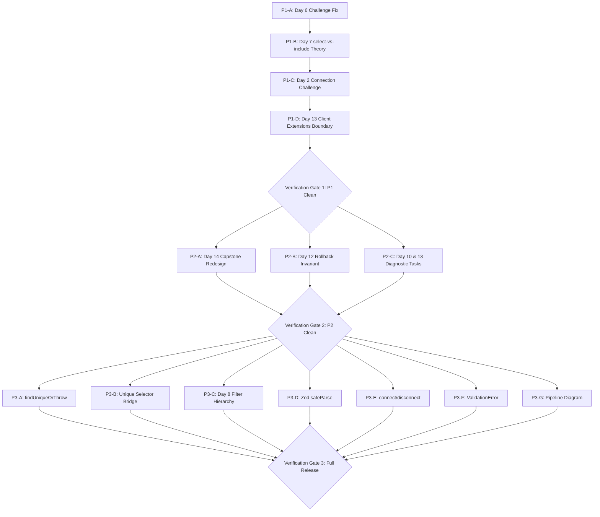

# Prisma Curriculum Redesign — Implementation Plan

> **Document Version:** 3.0 (Synthesized Pedagogical Blueprint)  
> **Status:** Ready for Execution  
> **Target Path:** `src/content/prisma/modules/`  
> **Tracker:** [`docs/PRISMA_CURRICULUM_TRACKER.md`](file:///d:/Everything%20Else/Programming%20Hero/google%20ai/sql_learning/docs/PRISMA_CURRICULUM_TRACKER.md)  
> **Review Reference:** [`docs/PRISMA_CURRICULUM_REVIEW.md`](file:///d:/Everything%20Else/Programming%20Hero/google%20ai/sql_learning/docs/PRISMA_CURRICULUM_REVIEW.md)

---

## 1. Executive Summary & Architectural Scope

This implementation plan defines the complete curriculum redesign for the 14-day Prisma learning track. It is built strictly upon the verified audit findings and pedagogical synthesis.

### 1.1 Core Constraints & Boundaries
1. **Module Numbering Frozen:** Days 1 through 14 remain exactly at their current numbers and positions. No module renumbering (no Day 8.5). Structural reorganization happens *within* modules.
2. **Seed Universe Stability:** The live database seed (`users` and `posts` tables with 3 rows each in `PRISMA_TASK_SETUP_SQL`) is permanently stable. Live executable tasks operate exclusively on this universe. Complex multi-table schemas are taught in `snippet-lab` mode.
3. **Engine-Aware Grading Classification:**
   - **Executable (`prismaReadTask` / `prismaWriteTask`):** `findUnique`, `findFirst`, `findMany`, `findUniqueOrThrow`, `findFirstOrThrow`, `create`, `createMany` (insert only), `update`, `updateMany`, `upsert`, `delete`, `deleteMany`, `$transaction` (batch and interactive proxy), `include`, `orderBy`, `skip`, `take`, scalar atomic math (`increment`).
   - **Snippet-Lab (`prismaSnippetTask`):** `groupBy`, `aggregate`, relational filters (`some`, `every`, `none`), list filters (`in`, `notIn`), cursor pagination, nested `select` on relations, `$queryRaw`, `$extends`, schema definitions (`schema.prisma`), CLI commands (`prisma generate`, `prisma migrate dev`), and error handling (`instanceof PrismaClientKnownRequestError`).

### 1.2 Explicitly Out-of-Scope Items
To prevent scope creep and maintain conceptual focus, the following items are intentionally excluded from this curriculum:
- `$executeRaw`: Excluded. `$queryRaw` sufficiently establishes the raw SQL escape hatch mental model.
- `migrate diff` and shadow databases: Excluded. Operational DBA tooling outside the scope of app developers.
- `distinct`: Excluded. Marginal pedagogical value within current seed constraints.
- `aggregate` beyond existing `groupBy`: Excluded. Advanced analytics query shapes belong in specialized tracks.
- `$transaction` options (`timeout`, `maxWait`): Excluded. Operational concurrency tuning.
- `prisma db pull`: Excluded. Reverse introspection confuses the unidirectional forward pipeline for beginners.
- Additional error codes beyond `P2002`, `P2025`, `P2003`, and `PrismaClientValidationError`.
- Schema attributes without live executable paths (`@updatedAt`, `@default(cuid())`): Documented as schema-only reference, not given pseudo-executable tasks.

---

## 2. Governing Principles

Every edit specified in this plan adheres to these 8 governing principles:

1. **Exposure ≠ Teaching ≠ Independent Recall:** A scaffolded API appearance in an early read-only lesson (e.g. `findUnique` as a witness in Day 1 or Day 3) is valid exposure. A challenge requiring independent synthesis of an untaught concept is a prerequisite violation.
2. **Mental Models Before APIs:** Concepts must establish the mental model before presenting syntax. For example: `select` defines return shape (projection); `include` attaches relations to an unchanged base shape. Never teach syntax as arbitrary rules and exceptions.
3. **One Coherent Learning Objective per Concept:** If a concept bundles multiple mental models, it must be subdivided. API count is secondary to conceptual atomicity.
4. **Challenges Must Produce New Diagnostic Information:** Every homework/challenge task must evaluate an independent competency. Repetitive tasks that re-test trivial lookups without new constraints fail diagnostic requirements.
5. **Transfer Over Recognition in Assessments:** Capstone and assessment challenges must state business requirements rather than named API hints. The learner must deduce which Prisma feature applies.
6. **Engine Constraints as Design Inputs:** What can be executed live vs evaluated via AST token checking dictates how concepts are introduced and practiced. Snippet-lab tasks must be explicitly framed as Code Labs.
7. **Scope is an Explicit Decision:** A missing Prisma feature is not inherently a defect. Features are included only when they directly support the progression from schema → client query → database lifecycle → service architecture.
8. **Progressive Variation in Challenges:** Each task introduces contextual variation, distinct constraints, or negative requirements (`noCols`, `ban`) to ensure genuine understanding.

---

## 3. Priority 1 — Defect Fixes (Immediate Execution)

### P1-A: Day 6 Client Lifecycle Challenge Overhaul
- **Target File:** [`src/content/prisma/modules/prisma-06-client-lifecycle.ts`](file:///d:/Everything%20Else/Programming%20Hero/google%20ai/sql_learning/src/content/prisma/modules/prisma-06-client-lifecycle.ts)
- **Target Line Range:** Lines 121–151
- **Current Issue:** The challenge `prisma06-hw-1` was temporarily converted to a basic `findUnique` read query, making it redundant with Day 1, Day 2, and Day 7. It fails to assess the core topic of Day 6: connection management, the `globalThis` singleton pattern in development environments, and graceful teardown.
- **Change Required:**
  Replace `prisma06-hw-1` with a `prismaSnippetTask` testing the production singleton pattern on `globalThis`.
- **Grading Classification:** `snippet-lab` (`prismaSnippetTask`)
- **Specification:**
  - **Task ID:** `prisma06-hw-1`
  - **Title:** `Production Gateway Singleton Pattern`
  - **Description:** Implement the standard Next.js/Express development singleton pattern to prevent connection pool exhaustion caused by hot-module reloading.
  - **Instructions:**
    1. Check if `globalThis.prisma` already exists; if not, instantiate `new PrismaClient()`.
    2. In non-production environments (`process.env.NODE_ENV !== 'production'`), assign the instance to `globalThis.prisma`.
  - **Starter Code (`code0`):**
    ```typescript
    import { PrismaClient } from '@prisma/prisma-client';

    // TODO: Prevent multiple PrismaClient instances across hot reloads
    export const prisma = new PrismaClient();
    ```
  - **Solution Code (`code1`):**
    ```typescript
    import { PrismaClient } from '@prisma/prisma-client';

    const globalForPrisma = globalThis as unknown as { prisma: PrismaClient };

    export const prisma = globalForPrisma.prisma || new PrismaClient();

    if (process.env.NODE_ENV !== 'production') globalForPrisma.prisma = prisma;
    ```
  - **Need Tokens:** `globalThis`, `new PrismaClient()`, `process.env.NODE_ENV !== 'production'`
- **Acceptance Criteria:** Tests verify the singleton lifecycle pattern without requiring unintroduced query methods (`findMany` / `orderBy`).

---

### P1-B: Day 7 `select-vs-include` Mental Model Correction
- **Target File:** [`src/content/prisma/modules/prisma-07-reading-data.ts`](file:///d:/Everything%20Else/Programming%20Hero/google%20ai/sql_learning/src/content/prisma/modules/prisma-07-reading-data.ts)
- **Target Line Range:** Lines 76–89
- **Current Issue:** Theory text states: *"You cannot use both at the same root level — to fetch relation fields while controlling scalars, nest a `select` inside your projection."* While technically true at the root level, explaining this as a blanket negative rule creates confusion. It obscures the underlying mental model: `select` defines the model's output shape; `include` appends relations to the model's default full shape.
- **Change Required:**
  Rewrite the `theory` and `shortDescription` of concept `select-vs-include`:
  - **Mental Model:**
    - `select` is **Projection**: you explicitly define the exact shape of the returned object. If you want related records with specific fields, you nest a `select` inside the relation key.
    - `include` is **Relation Attachment**: it preserves all scalar fields of the parent model and appends the related model.
    - Root-level conflict explained: Combining `select` and `include` at the same level is ambiguous because `select` says *"only return these exact keys"*, while `include` implies *"return all scalar keys plus this relation"*. Prisma resolves this by having you use nested `select`.
- **Grading Classification:** Theory & pedagogical text update.
- **Acceptance Criteria:** Text clearly explains the shape vs relation mental model. Erroneous "never both at once" phrasing is eliminated.

---

### P1-C: Day 2 Connection Challenge Redundancy Elimination
- **Target File:** [`src/content/prisma/modules/prisma-02-setup-connection.ts`](file:///d:/Everything%20Else/Programming%20Hero/google%20ai/sql_learning/src/content/prisma/modules/prisma-02-setup-connection.ts)
- **Target Line Range:** Lines 183–210
- **Current Issue:** Challenge `prisma02-hw-1` ("Key lookup over the wire") asks the student to run `prisma.user.findUnique` on `alex@prisma.io` selecting `id` and `email`. This is identical to Day 1's final challenge and tests query execution rather than Day 2's actual competencies (datasource setup, environment variables, `@map` name translation).
- **Change Required:**
  Replace `prisma02-hw-1` with a `prismaSnippetTask` that tests datasource configuration and environment variable wiring in `schema.prisma`.
- **Grading Classification:** `snippet-lab` (`prismaSnippetTask`)
- **Specification:**
  - **Task ID:** `prisma02-hw-1`
  - **Title:** `Configure Enterprise Datasource & Environment Wire`
  - **Description:** Complete the datasource block in `schema.prisma` to connect to PostgreSQL via `DATABASE_URL` and configure custom table mapping.
  - **Instructions:**
    1. Define `datasource db` with provider `"postgresql"` and url using `env("DATABASE_URL")`.
    2. Add `@@map("tbl_users")` on the `User` model to map to a legacy table name.
  - **Starter Code (`code0`):**
    ```prisma
    // TODO: Wire datasource to environment and map model
    datasource db {
      provider = "sqlite"
      url      = "file:./dev.db"
    }

    model User {
      id    Int    @id @default(autoincrement())
      email String @unique
    }
    ```
  - **Solution Code (`code1`):**
    ```prisma
    datasource db {
      provider = "postgresql"
      url      = env("DATABASE_URL")
    }

    model User {
      id    Int    @id @default(autoincrement())
      email String @unique

      @@map("tbl_users")
    }
    ```
  - **Need Tokens:** `provider = "postgresql"`, `env("DATABASE_URL")`, `@@map("tbl_users")`
- **Acceptance Criteria:** Eliminates query-level redundancy with Day 1 and Day 7. Accurately tests Day 2 datasource competencies.

---

### P1-D: Day 13 Client Extensions Architecture Boundary
- **Target File:** [`src/content/prisma/modules/prisma-13-errors-middleware.ts`](file:///d:/Everything%20Else/Programming%20Hero/google%20ai/sql_learning/src/content/prisma/modules/prisma-13-errors-middleware.ts)
- **Target Line Range:** Lines 129–145
- **Current Issue:** Concept 3 (`client-extensions`) appears directly after Express error middleware without an explicit structural boundary or pedagogical bridge. `$extends` is an advanced client customization topic, whereas concepts 1 and 2 focus on request error trapping.
- **Change Required:**
  Add an explicit transition and architectural bridge in the `theory` and `shortDescription` of `client-extensions`:
  - Clearly state that while Concepts 1 & 2 handle runtime errors at the HTTP boundary, `$extends` operates at the Client layer, serving as the modern, type-safe successor to deprecated middleware (`$use`).
  - Framing: *"Architectural Transition: From HTTP Route Error Handling to Engine-Level Client Extensions."*
- **Grading Classification:** Theory & framing update.
- **Acceptance Criteria:** Student understands why `$extends` is introduced here (before the full-stack architecture capstone in Day 14) and how it fits into the broader Prisma architecture.

---

## 4. Priority 2 — Assessment Strengthening

### P2-A: Day 14 Capstone Overhaul — Member Management API
- **Target File:** [`src/content/prisma/modules/prisma-14-api-capstone.ts`](file:///d:/Everything%20Else/Programming%20Hero/google%20ai/sql_learning/src/content/prisma/modules/prisma-14-api-capstone.ts)
- **Target Line Range:** Lines 200–295
- **Current Issue:** Day 14 challenges currently test isolated queries with direct method hints. A capstone must test the learner's ability to synthesize 7+ days of curriculum under realistic business requirements.
- **Change Required:**
  Replace the challenge section with the **Member Management API** scenario featuring business-requirement phrasing:
  1. **Task 1 (`prisma14-hw-1`, Executable):** Safe Paginated Member Roster.
     - *Requirement:* Retrieve a page of users ordered deterministically by ID ascending, skipping 0, taking 2, selecting only `id` and `email` (ensure `name` is omitted for privacy compliance).
     - *Learner decides:* `findMany`, `select: { id: true, email: true }`, `orderBy: { id: 'asc' }`, `take: 2`.
     - *Grade:* `executable` (`prismaReadTask`).
  2. **Task 2 (`prisma14-hw-2`, Snippet-Lab):** Atomic Registration with Welcome Note.
     - *Requirement:* When a new member registers, their account and their initial onboarding post must both be created in an all-or-nothing transaction. If either write fails, neither record may exist.
     - *Learner decides:* `prisma.$transaction([ ... ])` or interactive `prisma.$transaction(async (tx) => { ... })` using `tx.user.create` and `tx.post.create`.
     - *Grade:* `snippet-lab` (`prismaSnippetTask`).
  3. **Task 3 (`prisma14-hw-3`, Snippet-Lab):** Conflict-Trapping Member Service Handler.
     - *Requirement:* Create an Express controller handler that validates incoming request body `{ email, name }` with a Zod schema. If the database rejects the write due to a unique constraint violation, translate that error into an HTTP 409 Conflict response.
     - *Learner decides:* Zod `schema.safeParse()`, `Prisma.PrismaClientKnownRequestError`, check `err.code === 'P2002'`, return `res.status(409)`.
     - *Grade:* `snippet-lab` (`prismaSnippetTask`).
- **Grading Classification:** Hybrid (1 executable, 2 snippet-lab).
- **Acceptance Criteria:** Capstone challenges require transfer of multi-day knowledge without providing direct Prisma method name giveaways.

---

### P2-B: Day 12 Transaction Rollback Invariant Demonstration
- **Target File:** [`src/content/prisma/modules/prisma-12-nested-transactions.ts`](file:///d:/Everything%20Else/Programming%20Hero/google%20ai/sql_learning/src/content/prisma/modules/prisma-12-nested-transactions.ts)
- **Target Line Range:** Lines 100–140
- **Current Issue:** Day 12 teaches `$transaction` syntax but does not demonstrate rollback as an observable invariant. Learners see happy paths, not failure modes.
- **Change Required:**
  Add a dedicated rollback diagnostic task `prisma12-c2-t3` under `interactive-tx`:
  - **Title:** `Atomic Rollback Under Failure`
  - **Scenario:** Demonstrate an interactive transaction where step 1 updates User 1's name, step 2 attempts an invalid operation or explicitly throws, and verify that User 1's name remains unchanged in the database.
  - **Theory addition:** Visualizing the invariant:
    ```
    Seed state:    User 1 = "Alex"
    Transaction:   1. tx.user.update(User 1 -> "Alex Updated")  [Staged in DB TX]
                   2. throw new Error("Payment failed")        [Aborts TX]
    Final DB state: User 1 = "Alex"                             [Rolled back]
    ```
  - **Code Task:** Complete the error recovery block that catches the transaction failure and proves no partial state was committed.
- **Grading Classification:** `snippet-lab` (`prismaSnippetTask`).
- **Acceptance Criteria:** Student explicitly observes and writes rollback logic, validating ACID atomicity as an invariant.

---

### P2-C: Diagnostic Repair Tasks in Days 10 and 13
- **Target Files:**
  1. [`src/content/prisma/modules/prisma-10-update-upsert.ts`](file:///d:/Everything%20Else/Programming%20Hero/google%20ai/sql_learning/src/content/prisma/modules/prisma-10-update-upsert.ts)
  2. [`src/content/prisma/modules/prisma-13-errors-middleware.ts`](file:///d:/Everything%20Else/Programming%20Hero/google%20ai/sql_learning/src/content/prisma/modules/prisma-13-errors-middleware.ts)
- **Current Issue:** Challenges across Days 10 and 13 tell the student exactly what to write. Diagnostic capability (analyzing broken code and identifying the root bug) is untested.
- **Change Required:**
  - **In Day 10 (`prisma10-hw-2`):**
    - Provide broken `upsert` code that attempts to update a user using a non-unique field in `where: { name: 'Alex' }`.
    - Task: The learner must identify why TypeScript/Prisma rejects this at compile time, and fix the `where` clause to target `@unique email` or `@id id`.
    - *Grade:* `snippet-lab` (`prismaSnippetTask`).
  - **In Day 13 (`prisma13-hw-2`):**
    - Provide broken Express error handler that fails to check `instanceof Prisma.PrismaClientKnownRequestError`, causing runtime property access errors (`err.code`) on native JavaScript errors or Zod errors.
    - Task: Learner adds the type guard check and delegates unmatched errors to `next(err)`.
    - *Grade:* `snippet-lab` (`prismaSnippetTask`).
- **Grading Classification:** `snippet-lab` (`prismaSnippetTask`).
- **Acceptance Criteria:** Tests verify diagnostic repair skills without providing method name giveaways.

---

## 5. Priority 3 — Targeted Concept Additions

### P3-A: `findUniqueOrThrow` in Day 7
- **Target File:** [`src/content/prisma/modules/prisma-07-reading-data.ts`](file:///d:/Everything%20Else/Programming%20Hero/google%20ai/sql_learning/src/content/prisma/modules/prisma-07-reading-data.ts)
- **Target Location:** Under concept `read-methods` as task `prisma07-c1-t3`
- **Concept Need:** Standard `findUnique` returns `null` when a record is absent, forcing repetitive `if (!user) throw new NotFoundError()` boilerplate in service layers. `findUniqueOrThrow` throws `NotFoundError` (P2025) automatically.
- **Specification:**
  - **Task ID:** `prisma07-c1-t3`
  - **Title:** `Guaranteed Lookup with findUniqueOrThrow`
  - **Description:** Retrieve User 1 by `id`. Use `findUniqueOrThrow` so the query guarantees a non-null return type or throws an error.
  - **Code (`code1`):**
    ```typescript
    export async function getRequiredUser(id: number) {
      return await prisma.user.findUniqueOrThrow({
        where: { id },
        select: { id: true, email: true },
      });
    }
    ```
  - **Grading Classification:** `executable` (`prismaReadTask`). Supported by engine runtime!
- **Acceptance Criteria:** Executable against live SQLite seed; returns User 1; verified in SQL Lens.

---

### P3-B: Schema Uniqueness to Query Selector Bridge in Day 7 Theory
- **Target File:** [`src/content/prisma/modules/prisma-07-reading-data.ts`](file:///d:/Everything%20Else/Programming%20Hero/google%20ai/sql_learning/src/content/prisma/modules/prisma-07-reading-data.ts)
- **Target Location:** Concept `read-methods` theory
- **Concept Need:** Connect Day 3 schema constraints (`@unique`, `@id`) to Day 7 query capabilities (`findUnique`).
- **Text to Add:**
  > *"Compile-Time Selector Constraint: `findUnique` and `findUniqueOrThrow` only accept `where` arguments targeting fields marked with `@id` or `@unique` in your `schema.prisma`. The Prisma Client type generator enforces this at compile time—attempting to run `findUnique` on a non-unique field like `name` produces a TypeScript compilation error before any database query is sent."*
- **Grading Classification:** Theory text update.
- **Acceptance Criteria:** Explicitly bridges Day 3 schema definitions to Day 7 client type constraints.

---

### P3-C: Day 8 Filter Hierarchy Restructuring
- **Target File:** [`src/content/prisma/modules/prisma-08-filtering-pagination.ts`](file:///d:/Everything%20Else/Programming%20Hero/google%20ai/sql_learning/src/content/prisma/modules/prisma-08-filtering-pagination.ts)
- **Target Location:** Concept 1 reorganization
- **Concept Need:** Restructure the dense Day 8 into a coherent conceptual hierarchy without altering module numbering.
- **Hierarchy Diagram to Add:**
  ```
  Query Modifiers
  ├── Filtering (where)
  │   ├── Scalar Filters (Executable)
  │   │   ├── Equality:       { field: value }
  │   │   ├── Comparison:     { gt, gte, lt, lte }
  │   │   ├── String:         { contains, startsWith, endsWith }
  │   │   ├── Membership:     { in, notIn }
  │   │   └── Logical:        { AND, OR, NOT }
  │   └── Relational Filters (Snippet-Lab)
  │       ├── some:           At least one related record matches
  │       ├── every:          All related records match
  │       └── none:           No related records match
  └── Pagination & Sorting
      ├── Ordering:           orderBy: { field: 'asc' | 'desc' }
      └── Offset:             skip + take
  ```
- **Structure Update:**
  - Concept 1: `scalar-filters` (Executable: equality, comparison, logical)
  - Concept 2: `relational-filters` (Snippet-Lab: `some`, `every`, `none`)
  - Concept 3: `ordering-pagination` (Executable: `orderBy`, `skip`, `take`)
- **Grading Classification:** Theory + Task restructure (Executable + Snippet-lab).
- **Acceptance Criteria:** Day 8 adheres to atomic concept progression without overflowing engine capabilities.

---

### P3-D: Zod `.safeParse()` Task in Day 9
- **Target File:** [`src/content/prisma/modules/prisma-09-create-zod.ts`](file:///d:/Everything%20Else/Programming%20Hero/google%20ai/sql_learning/src/content/prisma/modules/prisma-09-create-zod.ts)
- **Target Location:** Concept `runtime-validation`, task `prisma09-c2-t3`
- **Concept Need:** Day 9 introduces Zod `.parse()`, which throws on validation failure. Production HTTP servers must use `.safeParse()` to return structured 400 Bad Request error payloads without unhandled exception overhead.
- **Specification:**
  - **Task ID:** `prisma09-c2-t3`
  - **Title:** `Non-Throwing Validation with safeParse`
  - **Description:** Validate incoming untrusted input using `UserCreateInput.safeParse()`. If validation fails, return `{ success: false, errors: result.error.flatten() }`.
  - **Code (`code1`):**
    ```typescript
    export function validatePayload(data: unknown) {
      const result = UserCreateInput.safeParse(data);
      if (!result.success) {
        return { ok: false, errors: result.error.flatten() };
      }
      return { ok: true, data: result.data };
    }
    ```
  - **Need Tokens:** `safeParse`, `!result.success`, `result.error`
- **Grading Classification:** `snippet-lab` (`prismaSnippetTask`).
- **Acceptance Criteria:** Student demonstrates safe validation flow suitable for API route handlers.

---

### P3-E: Relation Mutation (`connect`/`disconnect`) in Day 10
- **Target File:** [`src/content/prisma/modules/prisma-10-update-upsert.ts`](file:///d:/Everything%20Else/Programming%20Hero/google%20ai/sql_learning/src/content/prisma/modules/prisma-10-update-upsert.ts)
- **Target Location:** Concept `update-atomic`, task `prisma10-c1-t4`
- **Concept Need:** Learners know how to update scalar fields (`name`, `email`), but do not know how Prisma reassigns foreign key relationships without manual ID manipulation.
- **Specification:**
  - **Task ID:** `prisma10-c1-t4`
  - **Title:** `Relational Update via connect`
  - **Description:** Reassign an existing post to a new author using Prisma's nested `connect` relation syntax.
  - **Code (`code1`):**
    ```typescript
    export async function reassignPost(postId: number, newAuthorId: number) {
      return await prisma.post.update({
        where: { id: postId },
        data: {
          author: {
            connect: { id: newAuthorId },
          },
        },
      });
    }
    ```
  - **Need Tokens:** `author:`, `connect:`, `id: newAuthorId`
- **Grading Classification:** `snippet-lab` (`prismaSnippetTask`).
- **Acceptance Criteria:** Student demonstrates relational connection syntax in mutation operations.

---

### P3-F: `PrismaClientValidationError` in Day 13
- **Target File:** [`src/content/prisma/modules/prisma-13-errors-middleware.ts`](file:///d:/Everything%20Else/Programming%20Hero/google%20ai/sql_learning/src/content/prisma/modules/prisma-13-errors-middleware.ts)
- **Target Location:** Concept `error-classification`, task `prisma13-c1-t3`
- **Concept Need:** Differentiate compile-time/runtime schema type violations (e.g. missing required field passed through untyped `any` input) from database constraint rejections (`PrismaClientKnownRequestError`).
- **Specification:**
  - **Task ID:** `prisma13-c1-t3`
  - **Title:** `Catch Schema Validation Errors Centrally`
  - **Description:** Add handling for `Prisma.PrismaClientValidationError` to return HTTP 400 Bad Request before attempting to parse database error codes.
  - **Code (`code1`):**
    ```typescript
    if (err instanceof Prisma.PrismaClientValidationError) {
      return res.status(400).json({ error: 'Invalid query arguments or missing fields' });
    }
    ```
  - **Need Tokens:** `instanceof Prisma.PrismaClientValidationError`, `res.status(400)`
- **Grading Classification:** `snippet-lab` (`prismaSnippetTask`).
- **Acceptance Criteria:** Differentiates driver validation errors from SQL database errors.

---

### P3-G: Forward Compilation & Migration Pipeline in Day 2
- **Target File:** [`src/content/prisma/modules/prisma-02-setup-connection.ts`](file:///d:/Everything%20Else/Programming%20Hero/google%20ai/sql_learning/src/content/prisma/modules/prisma-02-setup-connection.ts)
- **Target Location:** Concept `datasource-mapping` theory
- **Concept Need:** Learners frequently conflate `prisma generate` and `prisma migrate dev`. A clear mental model diagram must explain that one produces TypeScript types for your app, while the other applies SQL DDL migrations to the database.
- **Diagram to Add:**
  ```
  schema.prisma (Single Source of Truth)
       │
       ├── npx prisma generate   ──▶  Prisma Client (TypeScript types + query builder)
       │                              Target: node_modules/@prisma/client (Application Code)
       │
       └── npx prisma migrate dev ──▶  Database Schema (SQL migration files + DB tables)
                                      Target: prisma/migrations/*.sql + Live Database
  ```
- **Grading Classification:** Theory text & diagram addition.
- **Acceptance Criteria:** Learner clearly distinguishes application artifact generation from database schema migration.

---

## 6. Execution Order & Verification Protocol

### Phase Execution Order


### Verification Commands
1. **Module Syntax & Structure Audit:**
   `npm test` or `npx tsx scripts/audit-task-rubric.ts` (if applicable)
2. **Prisma Test Suite:**
   `npm test src/tests/prisma`
3. **Full Workspace Build & Test:**
   `npm run test` or `npm run build`
