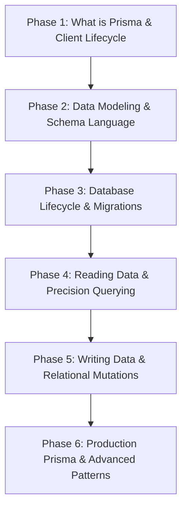

# Comprehensive Prisma Curriculum Transformation Plan

> **Document Status:** Active Transformation Master Plan  
> **Source-Verified Audit Reference:** [`docs/PRISMA_CURRICULUM_REVIEW.md`](file:///d:/Everything%20Else/Programming%20Hero/google%20ai/sql_learning/docs/PRISMA_CURRICULUM_REVIEW.md)  
> **Architecture Reference:** `prisma_curriculum_map.md` (29-Concept Inventory & Dependency Graph)  
> **Tracker:** [`docs/PRISMA_CURRICULUM_TRACKER.md`](file:///d:/Everything%20Else/Programming%20Hero/google%20ai/sql_learning/docs/PRISMA_CURRICULUM_TRACKER.md)  
> **Scope Directive:** Focused Prisma Track (Option A). Remove or relocate general framework & backend architecture concepts (Zod, Express Error Middleware, Router/Controller/Service Clean Architecture, generic CRUD lifecycle) into optional integration tracks.

---

## 1. Executive Summary of Audit Findings

Across all 14 modules, 29 concepts, and 80 tasks inspected directly in source code:
1. **Scope Contamination (4 Out-of-Scope Concepts):**
   - Day 9: `zod-validation` (Zod library syntax & HTTP 400 response handling)
   - Day 13: `error-middleware` (Express 4-argument `(err, req, res, next)` middleware mechanics)
   - Day 14: `clean-architecture` (Router → Controller → Service layering & OOP class refactoring)
   - Day 14: `crud-lifecycle` (Organizing CRUD into service methods without introducing new Prisma syntax)
2. **Missing Essential Prisma Primitives (6 Gaps):**
   - `prisma init` (project bootstrapping command)
   - `npx prisma db push` (prototyping workflow vs migrations)
   - `delete()` (primary teaching for single-row deletion)
   - Writing idempotent seeds (code-level `upsert` / `createMany({ skipDuplicates: true })`)
   - `@default` modifier family (`uuid()`, `cuid()`, `now()`, `autoincrement()`)
   - `select` on write operations (`create({ data, select })`)
3. **Severe Prerequisite Inversions & Cognitive Gaps:**
   - **Day 1:** Cold-start syntax demands (`findUnique`, `select`, `where` from scratch in a conceptual lesson).
   - **Day 1 vs Day 7:** `findUnique` and `select` used on Day 1, but formally explained 6 days later on Day 7.
   - **Day 10 vs Day 12:** `connect:` relational mutation introduced in Day 10 Task 4 before nested writes are taught on Day 12.
   - **Day 11:** Referential actions (`onDelete`) conflated with `deleteMany`.

---

## 2. Target 6-Phase Curriculum Architecture

The transformed curriculum will be organized into 6 coherent, logically sequenced phases:



### Phase 1: What Is Prisma & Client Lifecycle
* **Concepts:**
  1. `why-prisma-run-observe`: From Raw SQL Strings to Type-Safe Reads (Guided "Run & Observe" first touch).
  2. `prisma-cli-bootstrap`: Project Initialization (`prisma init`) & Dual Compilation Pipeline (`generate` vs `migrate`).
  3. `datasource-connection`: Datasource configuration (`datasource db`, `provider`, `DATABASE_URL`).
  4. `client-singleton-lifecycle`: The Global PrismaClient Singleton (`globalThis`), query logging (`log: ['query']`), and graceful disconnect (`$disconnect()`).

### Phase 2: Data Modeling (Schema Language)
* **Concepts:**
  1. `scalar-types-optionality`: Fields, types (`Int`, `String`, `Boolean`, `DateTime`), nullability (`?`), and `@id`.
  2. `default-modifiers`: The `@default` family (`autoincrement()`, `now()`, `uuid()`, `cuid()`).
  3. `enums-constraints`: `enum` declarations, multi-field constraints (`@@unique`), and performance indexes (`@@index`).
  4. `schema-mapping`: Decoupling database names with `@map` and `@@map`.
  5. `relations-one-to-many`: One-to-Many modeling (`@relation`, FK scalar field, relation list).
  6. `relations-one-to-one`: One-to-One modeling (`@unique` on foreign key scalar).
  7. `relations-many-to-many`: Implicit vs Explicit join models and composite keys (`@@id`).
  8. `referential-actions`: Schema integrity (`onDelete: Cascade / SetNull / Restrict`).

### Phase 3: Database Lifecycle & Seeding
* **Concepts:**
  1. `migrations-dev-deploy`: Authoring migrations (`migrate dev`) vs executing migrations in CI/CD (`migrate deploy`).
  2. `db-push-prototyping`: When to use `db push` (rapid prototyping / SQLite) and why it does not replace migrations.
  3. `migration-resets`: Deterministic environment recovery (`migrate reset`).
  4. `idempotent-seed-scripts`: Writing reproducible seeds with `upsert` and `createMany({ skipDuplicates: true })` + CLI execution (`db seed`).

### Phase 4: Reading Data & Precision Querying
* **Concepts:**
  1. `read-method-family`: `findUnique`, `findUniqueOrThrow`, `findFirst`, and `findMany`.
  2. `data-shaping-select`: Limiting fields with `select` and observing inferred TypeScript types.
  3. `relation-loading-include`: Eager loading with `include` vs nested `select` projections.
  4. `scalar-filtering`: Text & number operators (`contains`, `startsWith`, `in`, `gt`, `lt`, `not`).
  5. `relational-filtering`: Cross-table predicates (`some`, `every`, `none`).
  6. `sorting-pagination`: `orderBy`, offset pagination (`skip`, `take`), and cursor pagination (`cursor`).
  7. `aggregations-grouping`: Aggregation primitives (`_count`, `_sum`, `_avg`) and `groupBy` (optional/advanced).

### Phase 5: Writing Data & Relational Mutations
* **Concepts:**
  1. `create-writes`: Single creation (`create`) with response shaping (`select`) and batch insertion (`createMany`).
  2. `delete-writes`: Single row deletion (`delete()`) and batch deletion (`deleteMany()`).
  3. `update-writes`: Single updates (`update()`), batch updates (`updateMany()`), and atomic counters (`{ increment: 1 }`).
  4. `upsert-idempotency`: Atomic check-then-write with `upsert()`.
  5. `soft-delete-pattern`: Implementing logical deletion via `deletedAt DateTime?` and filtered queries.
  6. `nested-relational-writes`: Mutating relations in a single call (`create`, `connect`, `connectOrCreate`).
  7. `acid-transactions`: Sequential batching (`$transaction([...])`) and interactive transactions (`$transaction(async (tx) => ...)`) with the `tx` isolation invariant.

### Phase 6: Production Prisma & Advanced Patterns
* **Concepts:**
  1. `error-classification`: Catching `PrismaClientKnownRequestError` and branching on error codes (`P2002`, `P2025`).
  2. `client-extensions`: Extending the client via `$extends` (custom query and model methods).
  3. `raw-sql-escape-hatch`: Safe parameterized queries with `$queryRaw` and `Prisma.sql`.

---

## 3. Detailed Work Batches & Execution Roadmap

### Batch 1: Day 1 "Run & Observe" Overhaul & Immediate Fixes

* **Target File:** [`src/content/prisma/modules/prisma-01-why-prisma.ts`](file:///d:/Everything%20Else/Programming%20Hero/google%20ai/sql_learning/src/content/prisma/modules/prisma-01-why-prisma.ts)
* **Detailed Sub-Tasks:**

#### Step 1.1: Theory Narrative & Mental Model Alignment
- Update concept `raw-sql-vs-prisma` intro explanation to set learner expectations for the "Run & Observe" interactive model:
  - Explain that learners will first execute a live, working query to inspect the generated SQL and runtime object before writing custom code.
  - Keep the dual comparison: Raw string returning untyped tuples vs Prisma returning typed object graphs with autocompletion.

#### Step 1.2: Task 1 (`prisma01-c1-t1`) — "Run, Observe & Expand Selection"
- **Current problem:** Task requires writing `findUnique`, `where: { id: userId }`, and `select` from an empty skeleton without prior practice.
- **Implementation:**
  - **`initialCode`:** Provide complete, runnable query selecting `{ id: true, name: true }`.
    ```typescript
    export async function getUserById(userId: number) {
      // 1. Click "Run" to see the generated SQL and returned object!
      // 2. Then add `email: true` inside `select` to include the user's email.
      return await prisma.user.findUnique({
        where: { id: userId },
        select: {
          id: true,
          name: true,
        },
      });
    }
    ```
  - **Instructions:** "1. Click Run to observe the generated SELECT query and returned data. 2. Add `email: true` to the `select` block."
  - **`solutionCode`:** Includes `id: true, name: true, email: true`.
  - **SQL Parallel:** `initialSql`: `SELECT id, name FROM users WHERE id = 1;` → `solutionSql`: `SELECT id, name, email FROM users WHERE id = 1;`.
  - **Validation:** `requiredMethod: 'findUnique'`, `requiredFieldsInSelect: ['id', 'name', 'email']`, `requiredWhereClauses: ['id']`, `expectedRowCount: 1`.

#### Step 1.3: Task 2 (`prisma01-c1-t2`) — "Catching Runtime Errors at Compile Time"
- **Current problem:** Requires typing object shapes with loose hints.
- **Implementation:**
  - Reframe as an active demonstration of static type safety:
  - **`initialCode`:**
    ```typescript
    export async function getActiveMember(email: string) {
      // Notice how the schema only knows `email`, not `user_email`.
      // Fix the property name in `where` so the query succeeds!
      return await prisma.user.findUnique({
        where: { user_email: email } as any,
        select: {
          id: true,
          email: true,
        },
      });
    }
    ```
  - **Instructions:** "Fix the non-existent field `user_email` to the valid schema field `email`."
  - **`solutionCode`:** `where: { email }`, `select: { id: true, email: true }`.
  - **Validation:** `requiredMethod: 'findUnique'`, `requiredFieldsInSelect: ['id', 'email']`, `requiredWhereClauses: ['email']`.

#### Step 1.4: Challenge Task (`prisma01-hw-1`) — Scaffolded Safe Lookup
- **Current problem:** Asks the user to implement the entire function from a blank `// TODO: where + select`.
- **Implementation:**
  - Provide method signature with `where: { email }` already populated, leaving only the security-conscious `select` projection for the learner to write.
  - Validate that `name` is forbidden (`forbiddenFieldsInSelect: ['name']`) to reinforce the principle of least privilege in data fetching.

#### Step 1.5: Verification & Quality Gate
- Run test suite: `npx vitest run src/content/prisma` (or `npm test`).
- Verify in browser dev server (`npm run dev`) that Task 1 runs cleanly on the very first click without errors.
- Mark item `P0-A` in [`docs/PRISMA_CURRICULUM_TRACKER.md`](file:///d:/Everything%20Else/Programming%20Hero/google%20ai/sql_learning/docs/PRISMA_CURRICULUM_TRACKER.md) as `[x] Completed`.


### Batch 2: Phase 1 & 2 Consolidation (Tooling & Schema Language)

* **Target Modules & Files:**
  - [`src/content/prisma/modules/prisma-02-setup-connection.ts`](file:///d:/Everything%20Else/Programming%20Hero/google%20ai/sql_learning/src/content/prisma/modules/prisma-02-setup-connection.ts) (Day 2: CLI Lifecycle & Datasource)
  - [`src/content/prisma/modules/prisma-03-models-constraints.ts`](file:///d:/Everything%20Else/Programming%20Hero/google%20ai/sql_learning/src/content/prisma/modules/prisma-03-models-constraints.ts) (Day 3: Models & Fields)
  - [`src/content/prisma/modules/prisma-04-relations.ts`](file:///d:/Everything%20Else/Programming%20Hero/google%20ai/sql_learning/src/content/prisma/modules/prisma-04-relations.ts) (Day 4: Relations)

* **Detailed Sub-Tasks:**

#### Step 2.1: Day 2 Project Initialization (`npx prisma init`)
- **Current problem:** Day 2 Concept 1 (`cli-lifecycle`) immediately jumps to `npx prisma generate` and `pgbouncer` URL parsing without ever teaching the initial command that generates `schema.prisma` and `.env` (`npx prisma init`).
- **Implementation:**
  - Update `prisma02-c1-t1` to teach project initialization:
    - **Instructions:** "Run `npx prisma init --datasource-provider postgresql` to scaffold the `prisma/schema.prisma` and `.env` files."
    - **Validation:** `need: ['npx prisma init', '--datasource-provider postgresql']`.
  - Re-align Task 2 to teach client compilation (`npx prisma generate`) following schema edits, cementing the Dual Compilation Pipeline.
  - Re-wire `formatPooledDbUrl` into a focused supporting snippet.

#### Step 2.2: Day 3 `@default` Modifier Family Expansion (`uuid`, `cuid`, `now`, `autoincrement`)
- **Current problem:** Day 3 teaches `@default(autoincrement())` and `@default(now())`, but neglects the modern string ID generators (`uuid()` and `cuid()`) which are standard across distributed architectures.
- **Implementation:**
  - Expand Concept 1 (`scalar-types-optionality`) theory to present the full ID generator family:
    - Serial integer: `@id @default(autoincrement())`
    - Cryptographic UUID: `@id @default(uuid())`
    - Collision-resistant CUID: `@id @default(cuid())`
    - Timestamp defaults: `@default(now())`
  - In `prisma03-c1-t2` or a dedicated snippet, have the learner model a distributed user with a UUID primary key (`id String @id @default(uuid())`) and createdAt timestamp.

#### Step 2.3: Day 3 Disentangling Enums from Table Constraints
- **Current problem:** Concept 2 (`enums-and-constraints`) attempts to teach two completely separate primitives at once: application-level typed enums (`enum Role`) and database-level multi-field constraints (`@@unique([name, email])`, `@@index([email])`).
- **Implementation:**
  - Structure Concept 2 with explicit visual separation:
    - Section A: Value domain restriction with `enum`.
    - Section B: Multi-column business guarantees (`@@unique`) and performance indexes (`@@index`).
  - Ensure Task 1 focuses cleanly on enum constraints and Task 2 on composite uniqueness.

#### Step 2.4: Day 4 Relational Mental Models & Referential Integrity
- **Current problem:** Day 4 teaches 1:N, 1:1, and M:N relations in code, but lacks an intuitive visual representation of who owns the foreign key scalar vs the relation attribute.
- **Implementation:**
  - Clarify the "Virtual Relation Field vs Actual Foreign Key Column" mental model:
    - `author User` is a virtual client relation field (not stored in the table).
    - `authorId Int` is the concrete foreign key column stored in the database table.
  - Add explicit foreign key constraint verification in 1:1 modeling (`@unique` on foreign key scalar).

#### Step 2.5: Batch 2 Verification & Test Gate
- Run full test suite: `npx vitest run tests/tracks/phase6-prisma-content.test.ts`.
- Ensure all snippet matching, starter failures, and solution passes meet curriculum invariants.
- Update [`docs/PRISMA_CURRICULUM_TRACKER.md`](file:///d:/Everything%20Else/Programming%20Hero/google%20ai/sql_learning/docs/PRISMA_CURRICULUM_TRACKER.md) with Batch 2 progress items.


### Batch 3: Phase 3 Database Lifecycle & Seeding

* **Target Module & File:**
  - [`src/content/prisma/modules/prisma-05-migrations-seeding.ts`](file:///d:/Everything%20Else/Programming%20Hero/google%20ai/sql_learning/src/content/prisma/modules/prisma-05-migrations-seeding.ts) (Day 5: Migrations & Seeding)

* **Detailed Sub-Tasks:**

#### Step 3.1: Prototyping vs Production Migrations (`npx prisma db push`)
- **Current problem:** In the current Day 5, `db push` is banned and treated as a wrong answer (`ban: ['db push']`), completely missing its legitimate role in local prototyping and SQLite/CockroachDB dev cycles.
- **Implementation:**
  - Update Concept 1 (`migrate-workflow`) theory to introduce the dichotomy:
    - **Prototyping (`npx prisma db push`):** Synchronizes schema directly to database without writing SQL migration files. Ideal for rapid iteration, local SQLite, or hackathons.
    - **Production Migration (`npx prisma migrate dev` / `deploy`):** Generates versioned, reviewable SQL migration files (`prisma/migrations/`) tracked in version control and recorded in `_prisma_migrations`.
  - Add/refactor Task 1 to test understanding of when to use `db push` vs `migrate dev`.

#### Step 3.2: Code-Level Idempotent Seed Script Writing
- **Current problem:** Concept 2 is named `idempotent-seed`, but only asks the user to run CLI commands (`npx prisma db seed`) and edit `package.json`. It never actually teaches how to *write* an idempotent seed in TypeScript.
- **Implementation:**
  - Expand Concept 2 theory to demonstrate real idempotent seeding patterns:
    - Pattern A: `prisma.user.upsert({ where: { email }, update: {}, create: { ... } })` so running the seed multiple times never throws unique constraint errors (`P2002`).
    - Pattern B: `prisma.user.createMany({ data: [...], skipDuplicates: true })`.
  - Transform Task 1 or 2 into an active code-authoring task where the learner writes an `upsert` or `skipDuplicates` seed query in TypeScript.

#### Step 3.3: Deterministic Environment Recovery (`migrate reset`)
- **Current problem:** Verify and strengthen the `prisma migrate reset --force` challenge task to ensure learners understand the complete developer lifecycle: drop → migrate all → seed.

#### Step 3.4: Batch 3 Verification & Test Gate
- Run test suite: `npx vitest run tests/tracks/phase6-prisma-content.test.ts`.
- Ensure all snippet and execution validations pass.
- Update [`docs/PRISMA_CURRICULUM_TRACKER.md`](file:///d:/Everything%20Else/Programming%20Hero/google%20ai/sql_learning/docs/PRISMA_CURRICULUM_TRACKER.md) with Batch 3 progress.


### Batch 4: Phase 4 Querying & Reads Alignment

* **Target Modules & Files:**
  - [`src/content/prisma/modules/prisma-07-reading-data.ts`](file:///d:/Everything%20Else/Programming%20Hero/google%20ai/sql_learning/src/content/prisma/modules/prisma-07-reading-data.ts) (Day 7: Reading Data)
  - [`src/content/prisma/modules/prisma-08-filtering-pagination.ts`](file:///d:/Everything%20Else/Programming%20Hero/google%20ai/sql_learning/src/content/prisma/modules/prisma-08-filtering-pagination.ts) (Day 8: Filtering & Pagination)

* **Detailed Sub-Tasks:**

#### Step 4.1: Foundational Read Method Contract (`findUnique` vs `findFirst` vs `findMany`)
- **Focus:** Day 7 Concept 1 (`read-methods`).
- **Pedagogical Alignment:**
  - Now that Day 1 is an onboarding "Run & Observe" experience, Day 7 serves as the **authoritative deep dive** into the four read methods:
    1. `findUnique`: Requires `@id` or `@unique` selector, returns `T | null`.
    2. `findUniqueOrThrow`: Requires `@id` or `@unique` selector, returns non-null `T` or throws `NotFoundError` (`P2025`).
    3. `findFirst`: Accepts arbitrary non-unique filters (`where: { name: 'Alex' }`), returns first matching `T | null`.
    4. `findMany`: Returns an array `T[]`, never null.
  - Verify that all three tasks (`prisma07-c1-t1`, `prisma07-c1-t2`, `prisma07-c1-t3`) cleanly contrast these TypeScript selector contracts.

#### Step 4.2: Data Shaping (`select`) vs Relation Loading (`include`)
- **Focus:** Day 7 Concept 2 (`select-vs-include`).
- **Pedagogical Alignment:**
  - Address the root-level exclusivity rule: Why `select` and `include` cannot be used together at the root level of a query.
  - Teach the canonical resolution: Nested `select` inside a relation field (`posts: { select: { title: true } }`) to shape both parent and related objects simultaneously without over-fetching.

#### Step 4.3: Decoupling Scalar Filters from Relational Cross-Table Filters
- **Focus:** Day 8 Concept 1 (`filter-operators`).
- **Pedagogical Alignment:**
  - Emphasize the two distinct mental models:
    - **Scalar Predicates:** Single-table operators (`contains`, `startsWith`, `in`, `gt`/`lt`) mapping directly to SQL `LIKE`, `IN`, `>`, `<`.
    - **Relational Predicates:** Cross-table quantification (`some`, `every`, `none`) that evaluates child relation collections (e.g. users who have *some* published posts).
  - Verify that tasks transition smoothly from single-field scalar matching to multi-table collection evaluation.

#### Step 4.4: Sorting & Deterministic Pagination Strategies (Offset vs Cursor)
- **Focus:** Day 8 Concept 2 (`pagination-strategies`) and Concept 3 (`aggregating-grouping`).
- **Pedagogical Alignment:**
  - Reinforce that pagination must **always** be paired with deterministic `orderBy`.
  - Contrast **Offset Pagination (`skip`/`take`)** for small datasets vs **Cursor Pagination (`cursor`/`take`)** for infinite scroll / large scale where `OFFSET N` performance degrades to $O(N)$ table scans.
  - Review `aggregating-grouping` to ensure `groupBy` and `_count` remain self-contained.

#### Step 4.5: Batch 4 Verification & Test Gate
- Run test suite: `npx vitest run tests/tracks/phase6-prisma-content.test.ts`.
- Verify all AST, executable, and SQL lens invariants.
- Update [`docs/PRISMA_CURRICULUM_TRACKER.md`](file:///d:/Everything%20Else/Programming%20Hero/google%20ai/sql_learning/docs/PRISMA_CURRICULUM_TRACKER.md) with Batch 4 progress items.


### Batch 5: Phase 5 Writes & Mutations Overhaul
* **Files:**
  - [`prisma-09-create-zod.ts`](file:///d:/Everything%20Else/Programming%20Hero/google%20ai/sql_learning/src/content/prisma/modules/prisma-09-create-zod.ts)
  - [`prisma-10-update-upsert.ts`](file:///d:/Everything%20Else/Programming%20Hero/google%20ai/sql_learning/src/content/prisma/modules/prisma-10-update-upsert.ts)
  - [`prisma-11-relations-delete.ts`](file:///d:/Everything%20Else/Programming%20Hero/google%20ai/sql_learning/src/content/prisma/modules/prisma-11-relations-delete.ts)
  - [`prisma-12-nested-transactions.ts`](file:///d:/Everything%20Else/Programming%20Hero/google%20ai/sql_learning/src/content/prisma/modules/prisma-12-nested-transactions.ts)
* **Changes:**
  - Replace `zod-validation` in Module 9 with dedicated `delete()` and `deleteMany()` instruction.
  - Teach `select` on write operations (`create({ data, select })`).
  - Move `connect:` out of Module 10 Task 4, placing it into Module 12 (Nested Writes).
  - Separate referential actions (`onDelete`) from general deletion tasks in Module 11.

### Batch 6: Phase 6 Production & Out-of-Scope Decommissioning
* **Files:**
  - [`prisma-13-errors-middleware.ts`](file:///d:/Everything%20Else/Programming%20Hero/google%20ai/sql_learning/src/content/prisma/modules/prisma-13-errors-middleware.ts)
  - [`prisma-14-api-capstone.ts`](file:///d:/Everything%20Else/Programming%20Hero/google%20ai/sql_learning/src/content/prisma/modules/prisma-14-api-capstone.ts)
* **Changes:**
  - Replace Express error middleware (`error-middleware`) with pure Prisma error handling (classifying `P2002`, `P2025`, and validation errors).
  - Replace `clean-architecture` and `crud-lifecycle` with a pure Prisma Capstone (combining transactions, client extensions, raw SQL, and error trapping).

---

## 4. Verification & Testing Strategy

For each batch:
1. Validate TypeScript compilation and schema integrity: `npm run type-check` (or `npx tsc --noEmit`).
2. Run unit tests across all Prisma modules: `npm test`.
3. Verify interactive rendering in browser with dev server (`npm run dev`).
