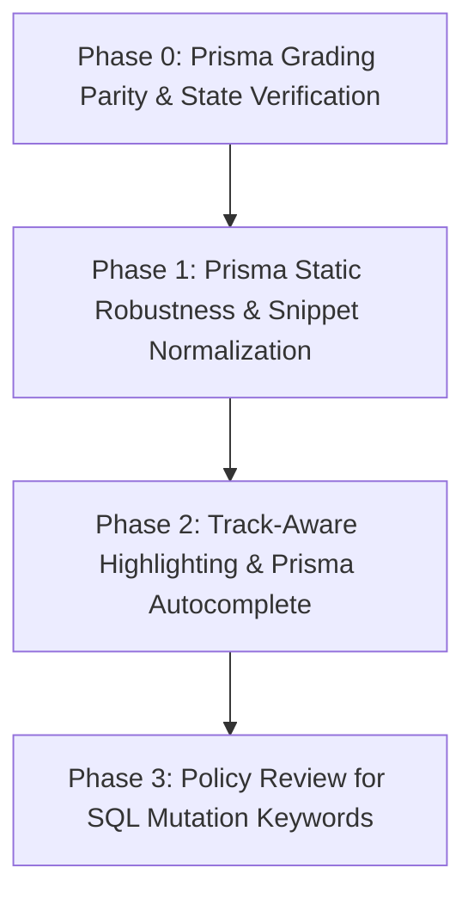

# Validation Equivalence, Grading Parity & Editor Architecture Plan

> **Target:** Bring Prisma track grading up to the same rigorous standard as the SQL track, close proven mutation false-accept vulnerabilities, fix reference NULL-writes/preview drift, normalize static validators for approach fairness, and implement track-aware syntax highlighting without heavy dependencies or CSP compromises.
> **Standard:** Zero regressions on 870 passing tests; zero new npm dependencies; adherence to `script-src 'self'` CSP; 100% honesty in grading and pedagogy.

---

## 1. Verified Ground Truth & Architectural Debate

### 1.1 Empirical Baseline (Measured on this Codebase)
| Metric / Invariant | Measured Value | Source of Truth |
| :--- | :--- | :--- |
| **Curriculum Census** | 424 SQL tasks / 76 Prisma tasks | `scripts/audit-all-tasks.ts`, `prisma-curriculum-index.ts` |
| **Test Suite** | 870 passed across 76 test files | `npm test` (vitest v4.1.11) |
| **Editor / UI Test Core** | 325 tests (26 files); 153 tests (9 files) strictly on autocomplete/editor | `tests/ui/` |
| **SQL Grading Census** | 291 `requireExactResult`, 129 mutation/DDL, 47 `strictConstruct` (all SELECTs, 0 on mutations) | `scripts/audit-grading-policy.ts` |
| **SQL Equivalence Suite** | 291 tasks, 866 rewrite variants, 0 findings | `scripts/audit-equivalence.ts` |
| **Prisma Pipeline Census** | 76 tasks: 35 executable (lens-backed), 41 read-through (static labs) | `scripts/audit-prisma-grading-pipeline.ts` |
| **Theme System** | Global user-selectable themes (`graphite` default, `sky` alternative) | `src/lib/theme-system.ts`, `ThemeProvider.tsx` |
| **Security & CSP** | `script-src 'self'` with zero CDNs and zero external sources allowed | `next.config.ts:13-28` |

---

### 1.2 Corrections & Concessions to Prior Analysis

1. **Prisma Target Regex Robustness:**
   - *Claim:* `extractPrismaTarget` fails on variable assignments or multiline queries.
   - *Correction:* **False**. In `prisma-validator.ts:33`, `/prisma\s*\.\s*([A-Za-z_][A-Za-z0-9_]*)\s*\.\s*([A-Za-z_$][A-Za-z0-9_$]*)\s*\(/` is unanchored and `\s` spans whitespace and newlines. `const x = await prisma.user.findMany({})` and multiline chaining extract cleanly.
2. **Nested Filter Presence:**
   - *Claim:* `where: { status: { equals: 'ACTIVE' } }` fails validation.
   - *Correction:* **False**. In `prisma-validator.ts:135`, `requiredWhereClauses` tests `new RegExp('\\b' + f + '\\b').test(whereBlock)`. The nested `equals` structure retains the field identifier `status`, so it passes.
3. **SQL Mutation Grading Mechanics:**
   - *Claim:* DML/DDL tasks are rejected by rigid keyword checks even if final database state is identical.
   - *Correction:* **Misleading**. SQL mutations are graded by **final database state replay** (Rule 2 in `GRADING_POLICY.md` & `submit-pipeline.ts:143-168`). Of the 95 mutation construct rules, 53 are `requiredColumns` (verifying DDL schema structure, which *is* the deliverable), 15 are `requireView`, and 19 are `trigger`/`procedure`/`function`. Zero mutations carry `strictConstruct`. The only policy question resides in ~40 tasks with state-visible keyword checks (`requireWhere: 23`, `whereContainsTerms: 9`).
4. **Theme Alignment:**
   - *Claim:* "Prisma Theme (sky)".
   - *Correction:* **False**. `graphite` and `sky` are global app themes toggled via `ThemeToggle.tsx`. Neither track forces a theme on the user.

---

### 1.3 The Critical Bugs Uncovered

Empirical probing revealed three severe vulnerabilities in the Prisma pipeline that were completely overlooked by high-level inspections:

#### Vulnerability A: Prisma Mutation False-Accepts (Missing State Verification)
- **The Defect:** `PrismaSubmitHooks` ([prisma-submit-pipeline.ts:146-151](file:///d:/Everything%20Else/Programming%20Hero/google%20ai/sql_learning/src/lib/prisma-engine/prisma-submit-pipeline.ts#L146-L151)) declares only `{ execute, resetDatabase }`. When `track-submit.ts:143` bridges session hooks to the Prisma pipeline, it explicitly drops the state hooks:
  ```typescript
  hooks: { execute: hooks.execute, resetDatabase: hooks.resetDatabase }
  ```
- **The Consequence:** Prisma execution grading only tests `affectedRows` / `rowCount`. It does not compare post-execution database state.
- **Empirical Proof:** On `prisma10-c1-t1` ("Rename one user"):
  - Submitting `where: { id: 2 }` (renaming the wrong user) reports **PASSED** because 1 row was affected.
  - Submitting `data: { name: 'HACKED' }` reports **PASSED**.
  - This completely violates Rule 2 of `GRADING_POLICY.md` ("A wrong-row UPDATE reports the same affectedRows as the right one — only the state comparison can tell them apart").

#### Vulnerability B: Reference Solutions Emit NULL Writes & Authored Previews Have Drifted
- **The Defect:** In 9 out of 35 executable Prisma references, generated runtime SQL contains unintentional `NULL` writes (e.g. `UPDATE users SET name = NULL WHERE id = 1`) because demo runtime bindings are missing for certain params.
- **Preview Drift:** 21 out of 35 authored `task.prisma.generatedSql` arrays disagree with the SQL that actually executes at runtime (e.g. authored `name = 'Alexandra'` vs runtime `name = NULL`). No consumer in `src/components` renders `task.prisma.generatedSql`, and no audit checks it. It is dead, drifting metadata.

#### Vulnerability C: Instrument Asymmetry
- SQL has 12 dedicated, hardened audit scripts continuously validating equivalence, grading policy, taught-before-tested rules, and keyword cases.
- Prisma has only 1 audit script (`audit-prisma-grading-pipeline.ts`), which only checks `solution passes / starter fails / lens ran`. It never tests wrong-value mutations or alternative syntax formulations.

---

### 1.4 Editor Strategy Debate: Why Monaco is a Trap vs. The Track-Aware Tokenizer

| Evaluation Axis | Option 1: Monaco for All / Prisma | Option 2: Track-Aware Tokenizer (Recommended) |
| :--- | :--- | :--- |
| **Security & CSP** | **Fails / High Risk**: Prod CSP enforces `script-src 'self'`. Default Monaco loader uses external CDN (`jsdelivr`), which is hard-blocked. Requires self-hosting workers and configuring `worker-src 'self' blob:`. | **Zero Risk**: 100% inline, zero external scripts or web-worker dependencies. |
| **Bundle & Footprint** | **Heavy**: `monaco-editor` unpacks to ~101.7 MB. Even tree-shaken with TS worker, shipped payload is multi-megabyte. | **Zero Added Weight**: Pure TS regex tokenizer (~150 LOC) matching `highlight-sql.ts`. |
| **Test Surface Impact** | **Severe**: Threatens 153 test-pinned files in `tests/ui/` (custom auto-pair, bracket matching, ranking, layout, telemetry, error gutters). | **Zero Regression**: Retains `<QueryEditor />` and all 870 unit tests intact. |
| **Pedagogic UX** | Generic VS Code IntelliSense lists hundreds of irrelevant JS globals (`Array`, `Promise`, `window`) rather than curated curriculum suggestions. | Preserves curriculum-aligned autocomplete and engine-position squiggles. |
| **Resolution Time** | 2–3 weeks of bundler wrestling and test refactoring. | Immediate, high-impact fix resolving all 3 editor surfaces. |

**Decision:** Adopt **Option 2 (Track-Aware Tokenizer)** immediately. Keep Monaco documented as an optional future enhancement if full standalone TypeScript IDE compilation is explicitly scheduled in a dedicated milestone.

---

## 2. Multi-Phase Execution Plan



---

### Phase 0: Prisma Grading Parity & Reference Integrity (P0 — Critical)
**Objective:** Eliminate Prisma mutation false-accepts, enforce state verification, fix reference NULL-writes, and eliminate preview drift.

1. **Task 0.1: Thread Database State Hooks into Prisma Pipeline**
   - **Files:** `src/lib/prisma-engine/prisma-submit-pipeline.ts`, `src/lib/track-submit.ts`
   - Extend `PrismaSubmitHooks` to include `getDatabaseState: () => DatabaseState` and `getCommittedState?: () => DatabaseState`.
   - In `track-submit.ts:143`, forward `getDatabaseState` and `getCommittedState` to `runAndGradePrismaSubmission`.
   - In `runAndGradePrismaSubmission`: For mutating operations (`create`, `update`, `delete`, and mutating `$transaction`), run `gradeFinalState(referenceSql, userSql, ...)` against the post-mutation database state.
2. **Task 0.2: Fix Reference Demo Bindings & Eliminate NULL Writes**
   - **Files:** `src/types/prisma-curriculum.ts`, `src/content/prisma/phase6-tasks.ts`, `src/content/prisma/modules/*.ts`, `src/lib/prisma-engine/prisma-submit-pipeline.ts`
   - Add an author-declared `prisma.demoVariables` (threaded via `taskSeedContext(task) = prismaSeedContext(task.prisma.demoVariables)`), so reference params the translator cannot see (`name`, `title`, …) render real values instead of the honest `NULL`. The shared demo-universe constant itself is NOT changed — per-task bindings keep the existing honest-NULL contract tests (`phase5-prisma-pipeline.test.ts`) valid.
   - Fixes **9 of 35** executable references (`name` ×8, `title` ×1); the runtime `unresolvedNull` guard stays as defence-in-depth.
   - Exact-equality with the authored `generatedSql` (id / upsert-branch differences) remains Task 0.3.
   - **Gate:** zero executable Prisma references render a `NULL` in a write position (corpus sweep in `tests/tracks/phase12-prisma-state-parity.test.ts`).
3. **Task 0.3: Deprecate the Dead `task.prisma.generatedSql` Previews (Path A — removed 2026-10-01)**
   - **Files:** `src/types/prisma-curriculum.ts`, `src/content/prisma/phase6-tasks.ts`, `src/content/prisma/modules/{prisma-01-why-prisma,prisma-09-create-zod,prisma-10-update-upsert,prisma-11-delete-cascades}.ts`
   - `task.prisma.generatedSql` had ZERO code consumers; every live `generatedSql` is the runtime `PrismaSubmitOutcome.generatedSql` (already the SQL Lens's single source). The authored field also defaulted to `solutionSql` on unset tasks and drifted. Removed rather than reconciled: an exact-match rule would have forced the *idealized* previews to match engine quirks (e.g. omitted auto-increment `id`), degrading them.
   - **Gate:** `!('generatedSql' in task.prisma)` for every task (tripwire test); runtime lens unaffected.
4. **Task 0.4: Create `audit:prisma-equivalence`** — ✅ delivered 2026-10-01
   - **New File:** `scripts/audit-prisma-equivalence.ts` — the Prisma mirror of `audit-equivalence.ts`; every probe routes through the real `submitForTask` router with telemetry off (`record: false`) and UI-parity hooks.
   - **Invariants Tested:**
     - **False-Reject Gate (must PASS):** form-equivalent rewrites — `select` key order reversed, assignment form (`return await prisma.…` → `const r = await …; return r;`, plus bare-`await` statements and `this.`-prefixed calls), multiline reflow (the call's args collapsed to one line), nested operator form (`where: { f: v }` → `where: { f: { equals: v } }`), and quote-style flip inside the call args. A variant is only probed while every authored `requiredCodeSnippets` fragment survives — the task's own literal contract defines its accepted language.
     - **False-Accept Gate (must FAIL):** a wrong write value (`data: { name: 'WRONG' }`), a wrong target row (`where: { id: 999 }`, or a match-nothing filter added to a where-less read), the load-bearing `where` clause deleted, and every required code snippet deleted (one at a time).
     - **Reference self-consistency:** every reference passes its own task, and no reference carries its own forbidden snippet (that task would be impossible).
   - **Deliveries beyond the original text (each one evidence-driven, from the spike):**
     - The drop-`where` probes exposed a phantom-pass hole: learner code that fails translation on a **client-code lab** (its reference IS translatable) fell into the read-through contract and was graded against the **reference's** dataset. `runAndGradePrismaSubmission` now fails untranslatable submissions there (`isExecutablePrismaTask` + `!expectFailure`); snippet labs keep the contract untouched. The three affected probes (`prisma12-c2-t1`, `prisma12-hw-1`, `prisma13-c1-t2`) now fail at `stage: 'validation'`.
     - `compareFinalState`'s documented flexible-insert carve-out (custom VALUES accepted on rows a reference INSERTs — SQL-track parity policy) owns 6 probes: they are **skipped with the reason named**, never flagged.
   - **Deferred by design (named in the audit header):** quoted object keys (`"name": true`) → Phase 1.2 — they fail today because those tasks' authored literal fragments define their language; asserting them now would only re-report a scheduled fix. The CLI half (quote / `=`-flag / runner normalization) was delivered by Task 1.1 and is NOW asserted: the audit runs `cli-*` fairness families (**173** fairness probes · 0 findings, was 147).
   - **Gate:** `npm run audit:prisma-equivalence` → **147** fairness probes passed · **158** false-accept probes caught · **279** named skips · **0 findings · exit 0**; wired into CI + `audit:all` (after `audit:prisma-grading-pipeline`); `npm test` 880/880; `audit:all` exit 0.

---

### Phase 1: Prisma Static Robustness & Snippet Normalization (P1)
**Objective:** Eliminate false-rejects in snippet labs and structural checks when learners write valid variants.

1. **Task 1.1: Flexible CLI & Snippet Matching** — ✅ delivered 2026-10-01
   - **Files:** `src/lib/prisma-engine/prisma-validator.ts` (canonical matcher: `PRISMA_CLI_RUNNER_SRC` + `isCliFragment` + `canonicalizeCli` + `snippetMatches`, wired into required AND forbidden snippets) and `src/lib/prisma-engine/prisma-submit-pipeline.ts` (display: `prismaCliCommandIn` + `simulatePrismaCliOutput` share the same contract).
   - Normalize quotes (`--name "init"` ≡ `--name 'init'` ≡ `--name init`) — for CLI-shaped fragments only; failure feedback quotes the AUTHORED fragment.
   - Support equal-sign flags (`--name=init` ≡ `--name init`).
   - Normalize package runner prefixes (`pnpm dlx prisma`, `bunx prisma`, `yarn prisma` ≡ `npx prisma`) and whitespace splits (double space / newline) — in grading AND in the terminal simulation, where the `$ …` echo keeps the learner's own spelling and the migration name is the unwrapped value either way.
   - **Gate:** characterization matrix **11/39 → 39/39** (the forbidden side still catches a whitespace-mangled command); `phase5-prisma-pipeline.test.ts` `P1.1` block, 5 tests (suite **885/885**); `audit:prisma-equivalence` gained the `cli-*` fairness families → **173 fairness probes · 158 false-accept probes · 283 named skips · 0 findings**.
2. **Task 1.2: Quoted Object Keys & Structural Normalization**
   - **Files:** `src/lib/prisma-engine/prisma-validator.ts`
   - Fix `requiredFieldsInSelect`: Replace `/\\b${f}\\s*:\\s*true\\b/` with a regex matching both bare and quoted keys: `/(['"]?)${f}\\1\\s*:\\s*true/`.
   - Anchor `extractBlock` using `new RegExp(`\\b${key}\\s*:\\s*\\{`)` instead of fragile `indexOf(key)`.

---

### Phase 2: Track-Aware Syntax Highlighting & Editor Affordances (P2)
**Objective:** Deliver crisp, modern syntax highlighting for TypeScript and Prisma schema code while strictly preserving existing theme tokens and zero dependencies.

1. **Task 2.1: Implement `highlightTypeScript` Tokenizer**
   - **New File:** `src/lib/highlight-typescript.ts`
   - Tokenizes TS/JS keywords (`const`, `let`, `await`, `async`, `return`, `import`, `export`), Prisma keywords (`prisma`, `select`, `include`, `where`, `orderBy`, `data`), string literals, numbers, comments, and punctuation.
   - Reuses existing CSS variables (`--code-kw`, `--code-str`, `--code-comment`, `--code-punc`, `--code-ident`) so both `graphite` and `sky` themes render seamlessly.
2. **Task 2.2: Implement `highlightPrismaSchema` Tokenizer**
   - **New File:** `src/lib/highlight-prisma-schema.ts`
   - Highlights `model`, `enum`, `datasource`, `generator`, field types (`Int`, `String`, `Boolean`, `DateTime`), attributes (`@id`, `@default`, `@relation`, `@unique`, `@@index`), and comments.
3. **Task 2.3: Wire Track-Aware Tokenizer into `<QueryEditor />` and `<PrismaSchemaTab />`**
   - **Files:** `src/components/learning/QueryEditor.tsx`, `src/components/learning/prisma/PrismaSchemaTab.tsx`, `src/components/learning/SQLEditor.tsx`
   - Add `language?: 'sql' | 'typescript' | 'prisma'` prop to `QueryEditor`.
   - In `SQLEditor.tsx`, pass `language={schemaTab ? 'typescript' : 'sql'}`.
   - In `PrismaSchemaTab.tsx`, replace plain `<pre>` with schema-highlighted output.
4. **Task 2.4: Extend Autocomplete with Prisma Identifiers**
   - **Files:** `src/lib/autocomplete.ts`
   - When language is TypeScript, provide autocomplete suggestions for Prisma client calls: models (`user`, `post`), methods (`findMany`, `findUnique`, `create`, `update`, `delete`), and top-level query blocks (`where`, `select`, `include`, `orderBy`).

---

### Phase 3: SQL State-Visible Keyword Review (P3 — Deliberate Policy)
**Objective:** Review the ~40 SQL mutation tasks carrying keyword rules.

1. **Task 3.1: Audit the ~40 Mutation Tasks with `requireWhere` / `whereContainsTerms`**
   - Check if any learners could achieve correct state via alternative SQL (e.g. `WHERE id = 1 OR id = 2` vs `WHERE id IN (1, 2)`).
   - If final state matches and `strictConstruct` is not set, classify keyword mismatches as advisory notes rather than fatal failures.
   - Run `npm run audit:all` to ensure zero regression.

---

## 3. Verification & Acceptance Gates

Every phase must pass its strict acceptance gate before progressing:

| Gate | Target Command | Invariant Enforced |
| :--- | :--- | :--- |
| **P0 Gate** | `npx tsx scripts/audit-prisma-equivalence.ts` | 0 false-accepts on wrong row/value mutations; 0 false-rejects on valid rewrites. |
| **P1 Gate** | `npx vitest run tests/tracks/phase5-prisma-pipeline.test.ts` | Snippet labs accept `--name "init"`, `--name=init`, and `pnpm dlx`. |
| **P2 Gate** | `npx vitest run tests/ui/highlight-sql.test.ts` + visual check | All 3 editor surfaces properly tokenized; 870 unit tests stay 100% green. |
| **Final Gate** | `npm run audit:all && npm test` | Complete suite clean across all 500 tasks and 76 test files. |
